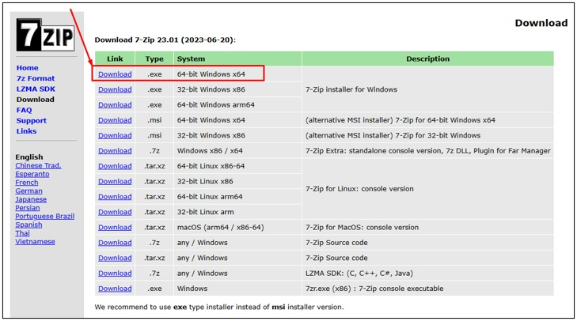
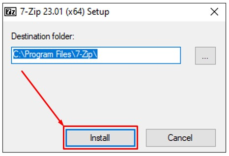
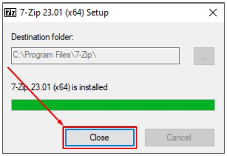
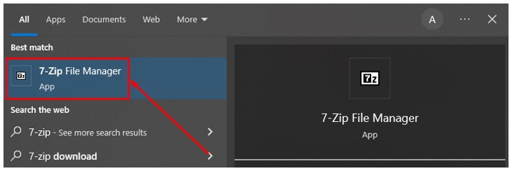
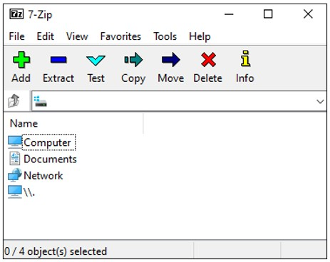

# 7-Zip

1. Silahkan unduh program 7-Zip, melalui link berikut: [https://www.7-zip.org/download.html](https://www.7-zip.org/download.html)

2. Setelah berada dihalaman unduh 7-Zip, pilih rilis terbaru dalam kasus ini rilis terbaru pada tanggal 2023-06-20 dengan versi 23.01, selanjutnya pilih opsi `Download` pada kolom `Link` dan sesuaikan dengan sistem operasi yang digunakan. Dalam kasus ini menggunakan sistem operasi windows, oleh karena itu memilih `64-bit Windows x64`.

   

3. Buka lokasi tempat kamu mengunduh setup installer 7-Zip, kemudian double klik pada setup installer tersebut. 

   

4. Akan tampil dialog untuk memilih lokasi tempat program 7-Zip akan diinstal. Biarkan saja sesuai nilai bawaan, setelah itu pilih tombol `Install`. 

   

5. Setelah selesai melakukan instalasi, pilih tombol `Close`. 

   
   
6. Pada sistem operasi kamu silahkan mencari program 7-Zip. Setelah itu pilih pada program tersebut.

   
   
7. Jika berhasil maka akan terlihat tampilan program 7-Zip. Selamat sekarang kamu telah berhasil melakukan instalasi program 7-Zip.

   
