# Haskell

1. Silahkan melakukan instalasi program 7-Zip terlebih dahulu dengan mengikuti tahapan berikut ini: [Instalasi 7-Zip](../archive/1.7zip.md)

2. Silahkan unduh compiler haskell, melalui link berikut: [https://www.haskell.org/downloads](https://www.haskell.org/downloads)

3. Setelah berada dihalaman unduh Haskell, di bagian `Find out more about the haskell toolchain` silahkan cari dan pilih pada `GHC: the Glasgow Haskell Compiler`. 

   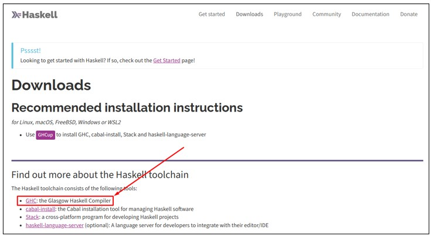

4. Akan terbuka situs GHC, selanjutnya pilih rilis terbaru. Dalam kasus ini rilis terbaru pada tanggal 10 November 2023 dengan GHC versi 9.4.8, setelah itu pilih opsi `Download`.

   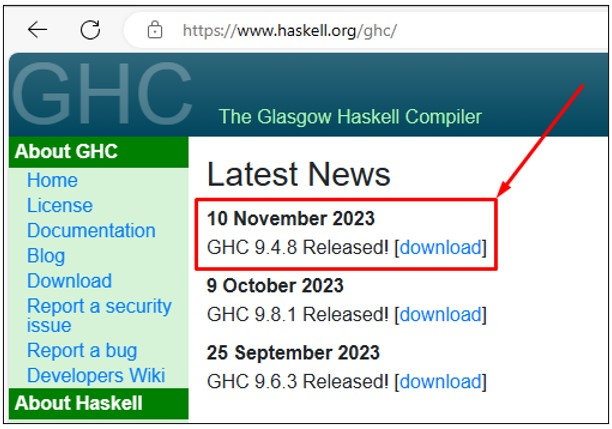

5. Akan terbuka situs untuk mengunduh GHC versi 9.4.8. Pada halaman ini silahkan scrool ke bawah sampai ke bagian `Binary Packages` setelah itu pada `Supported platforms` pilih sesuai dengan sistem operasi yang digunakan. Dalam kasus ini menggunakan sistem operasi windows, oleh karena itu memilih`Windows (x86_64)`

   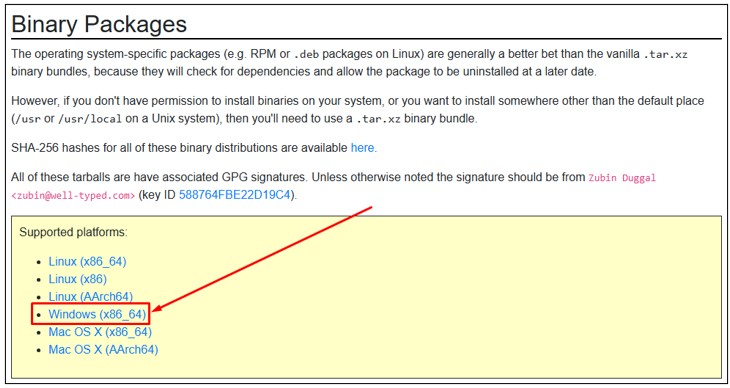

6. Pada halaman ini akan melakukan scrool otomatis ke bagian GHC untuk sistem operasi windows.  GHC yang akan diunduh dengan `GMP bignum implementation` setelah itu pilih `ghc-9.4.8-x86_64-unknown-mingw32.tar.xz` untuk mulai mengunduh GHC.

   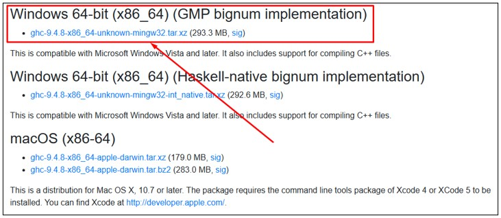

7. Setelah selesai mengunduh GHC, selanjutnya silahkan memindahkan file archive GHC tersebut ke lokasi yang aman. Dalam kasus ini lokasi yang dipilih berada di `C:\compiler`.

   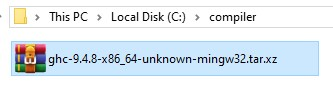

8. Setelah selesai memindahkan file archive GHC ke lokasi yang aman, selanjutnya klik kanan pada file archive GHC tersebut. Akan tampil context menu selanjutnya pilih pada menu `7-Zip` kemudian pilih `Extract Here`.

	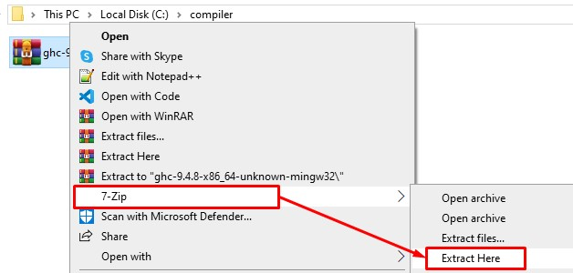

9. Tunggu sampai proses ekstraksi file archive `.tar` 7-Zip selesai.

	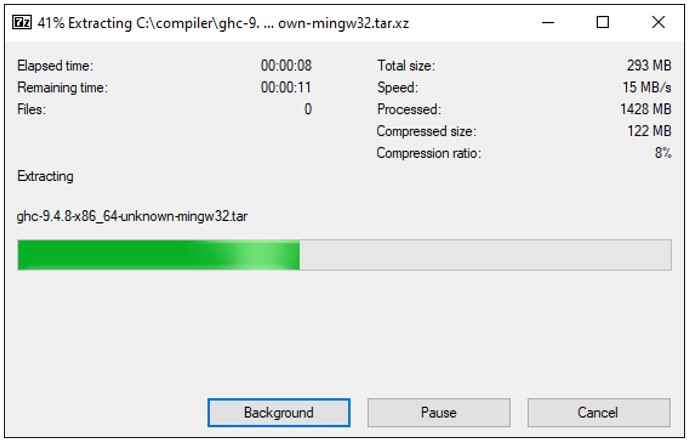
   
10. Setelah proses ekstraksi selesai, pada windows explorer pilih tab `View` selanjutnya pada toolbar cari dan centang pada opsi `File name extensions`. Maka pada lokasi ini akan terdapat 2 file archive yaitu dengan ekstensi `.tar` dan `.tar.xz`.

	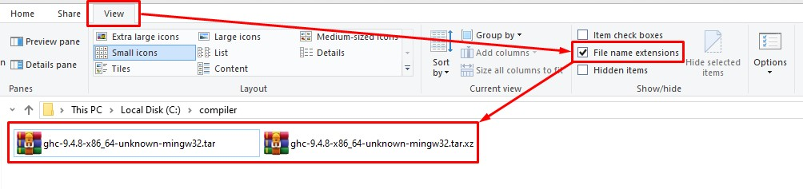
	
11. Klik kanan pada file archive dengan ekstensi `.tar`. Akan tampil context menu selanjutnya pilih pada menu `7-Zip` kemudian pilih `Extract Here`.

	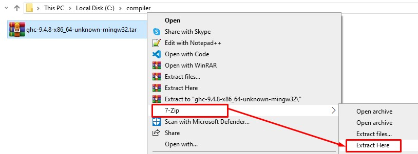
	
12. Tunggu sampai proses ekstraksi program 7-Zip selesai.

	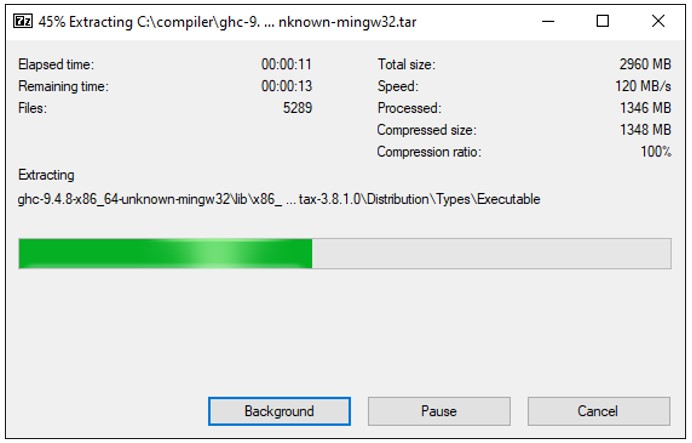
	
13. Setelah proses ekstraksi selesai, akan terdapat folder baru dengan nama `ghc-9.4.8-x86_64-unknown-mingw32`. Folder inilah yang berisikan program untuk dapat melakukan compile kode yang dituliskan menggunakan bahasa pemrograman Haskell.

	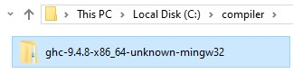
	
14. Setelah selesai melakukan ekstraksi GHC, selanjutnya buka windows terminal untuk mengecek apakah compiler telah terbaca dilingkungan windows.

	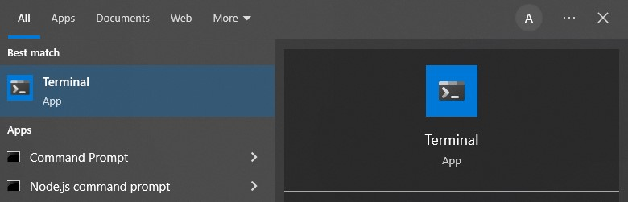
	
15. Pada windows terminal silahkan tuliskan perintah `ghc -v` untuk mengecek versi dari GHC. Ternyata GHC belum terbaca pada lingkungan windows. Selanjutnya mari kita daftarkan GHC ke lingkungan windows agar dapat dibaca.

	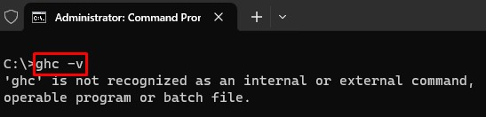
	
16. Pada windows cari `Environment`. Dari hasil pencarian pilih pada program `Edit the system environment variables`.

	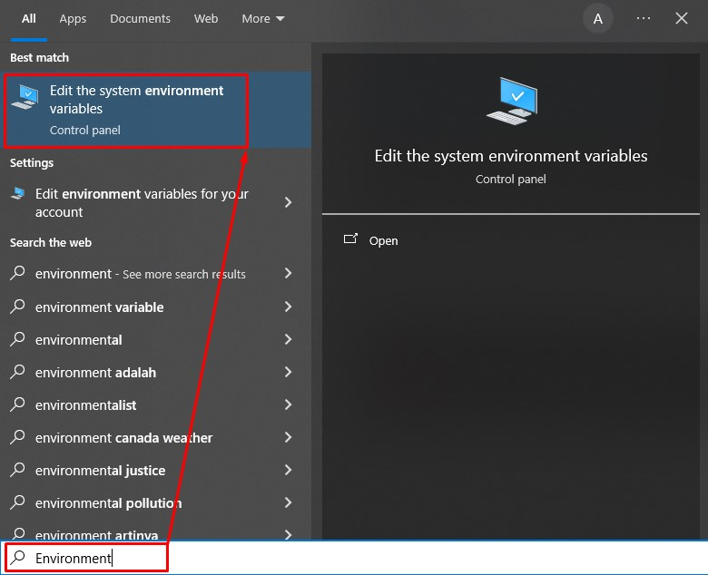
	
17. Akan tampil dialog `System Properties` selanjutnya pilih pada tombol `Environment Variables`.

	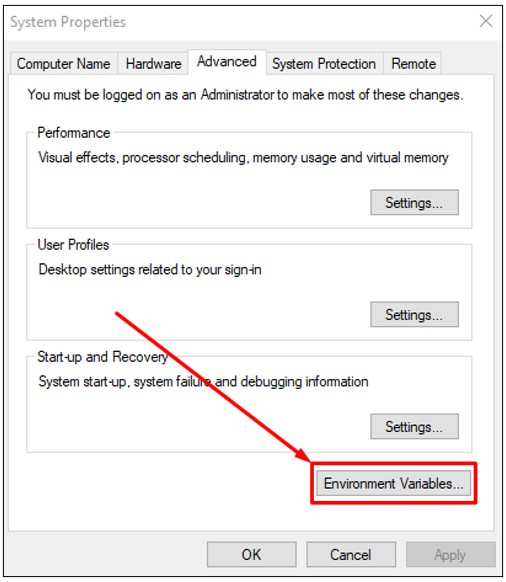
	
18. Akan tampil dialog `Environment Variables` selanjutnya pada bagian `System variables` di `Variable` pilih `Path`. Setelah itu pilih tombol `Edit`.

	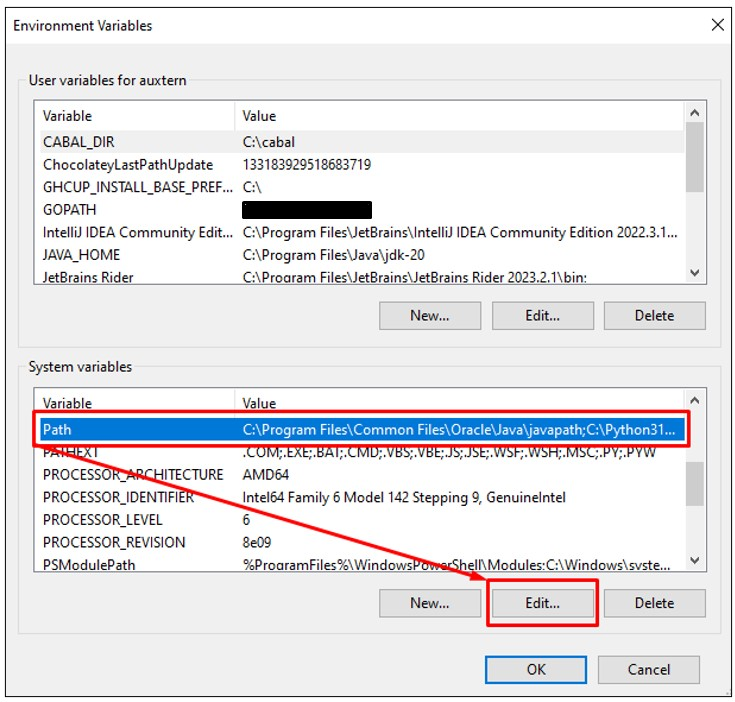
	
19. Akan tampil dialog `Edit environment variable` selanjutnya pilih tombol `New`. Akan tampil text field untuk tempat menuliskan lokasi program agar dapat terbaca oleh windows environment.  Karena sebelumnya lokasi GHC diinstal pada `C:\compiler\ghc-9.4.8-x86_64-unknown-mingw32` dan program compiler berada pada folder `bin` maka lokasi yang kita masukkan pada text field tersebut adalah `C:\compiler\ghc-9.4.8-x86_64-unknown-mingw32\bin`. Setelah itu pilih tombol `Ok` untuk setiap dialog-dialog yang terbuka agar dialog-dialog tersebut tertutup.

	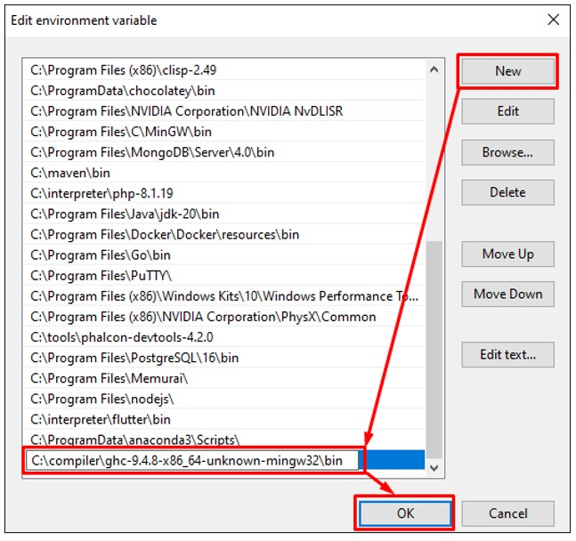

20. Setelah selesai mendaftarkan GHC ke windows environment, selanjutnya buka windows terminal untuk mengecek apakah sekarang compiler telah terbaca dilingkungan windows.

	
	
21. Pada windows terminal silahkan tuliskan perintah `ghc -v` untuk mengecek versi dari GHC. Jika berhasil maka sekarang dapat dilihat bahwa GHC telah terbaca oleh lingklungan windows. Selamat sekarang kamu telah berhasil melakukan instalasi compiler Haskell.

	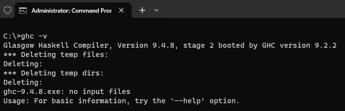

