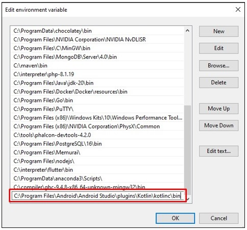
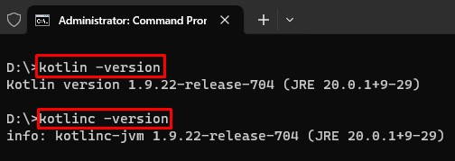

# Kotlin

1. Silahkan melakukan instalasi Android Studio terlebih dahulu dengan mengikuti tahapan berikut ini: [Instalasi Android Studio](../text-editor/2.android-studio.md)

2. Silahkan tambahkan lokasi kotlin pada Android Studio ke Windows path environment. Lokasi kotlin pada Android Studio berada di lokasi `C:\Program Files\Android\Android Studio\plugins\Kotlin\kotlinc\bin`. Lihat cara menambahkan lokasi program ke [Windows Path Environment](../tutorial/windows/path-environment.md).

  

3. Setelah selesai menambahkan lokasi kotlin ke lingkungan Windows, selanjutnya perlu melakukan pemeriksaan untuk mengetahui apakah kotlin telah terbaca atau belum di lingkungan Windows. Buka Windows Terminal selanjutnya tuliskan perintah `kotlin -version` dan `kotlinc -version`. Jika berhasil maka akan tampil versi kotlin yang digunakan. Dalam kasus ini menggunakan versi kotlin `1.9.22-release-704`. Selamat kamu telah berhasil menambahkan compiler kotlin.

  