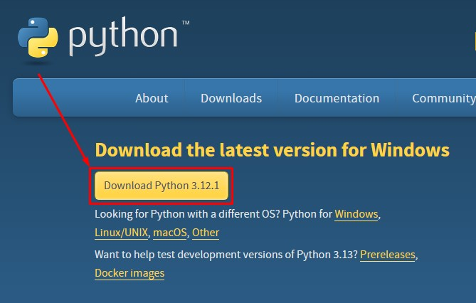
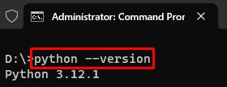

# Python

1. Silahkan unduh interpreter Python, melalui link berikut: [https://www.python.org/downloads](https://www.python.org/downloads/)

2. Setelah berada dihalaman unduh Python, di bagian `Download the latest version for Windows` silahkan pilih pada tombol `Download Python`.  Pada saat modul ini dibuat versi terbaru adalah `3.12.1`. Sesuaikan juga dengan sistem operasi yang digunakan. Dalam kasus ini menggunakan sistem operasi Windows.

   
   
3. Buka lokasi tempat kamu mengunduh setup installer Python, kemudian double klik pada setup installer tersebut. 

   
   
4. Akan tampil jendela untuk melakukan setup sebelum melakukan instalasi Python. Silahkan centang pada opsi `Use admin privileges when installing py.exe` dan `add python.exe to PATH`. Setelah itu pilih opsi `Install Now`. 

   
   
5. Tunggu sampai proses instalasi selesai.

   
   
6. Setelah proses instalasi selesai, silahkan memilih tombol `Close`.

   
   
7. Buka Windows Terminal, selanjutnya tuliskan perintah `python --version` untuk melihat versi Python yang terpasang. Jika berhasil maka akan tampil versi sesuai dengan yang telah diunduh sebelumnya. Selamat kamu telah berhasil melakukan instalasi Python.

   