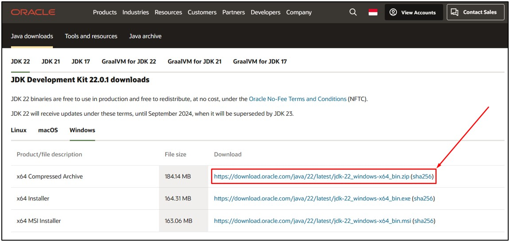
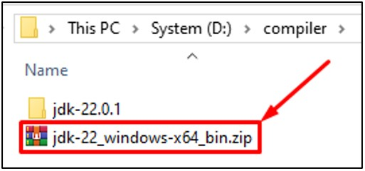
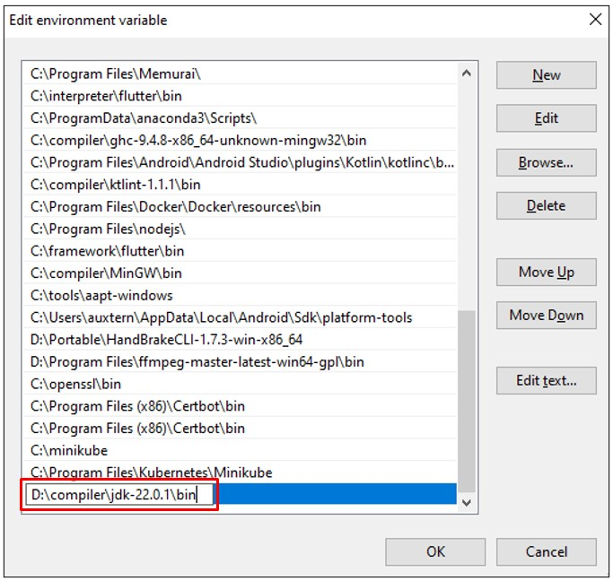
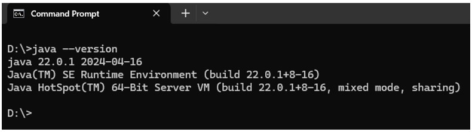

# Java Development Kit (JDK)

1. Silahkan unduh JDK, melalui link berikut: https://www.oracle.com/id/java/technologies/downloads/

2. Setelah berada di halaman unduh JDK silahkan pilih pada tab `Windows`. Selanjutnya pada bagian`Product` pilih pada`x64 Compressed Archive`.

	

3. Apabila telah selesai mengunduh archive JDK. Selanjutnya pindahkan file archive JDK ke lokasi yang aman. Setelah itu extract file archive JDK sehingga menghasilkan folder baru dengan nama `jdk-22.0.1` sesuai dengan versi JDK yang telah di download sebelumnya. Dalam kasus ini lokasi JDK berada pada direktori: `D:\compiler\jdk-22.0.1`.

	
	
3. Tambahkan lokasi program Java dari direktori JDK ke path environment windows kamu. Dalam kasus ini program Java berada pada lokasi `D:\compiler\jdk-22.0.1\bin`. Lihat tahapan [[Menambahkan Program ke Path Environment Windows](../tutorial/windows/path-environment.md)] jika belum tahu cara untuk menambahkannya.

	
	
4. Jika berhasil, maka apabila menjalankan perintah `java --version` pada terminal windows akan tampil output dari versi java yang telah dipasang sebelumnya. Selamat kamu telah berhasil memasang Java.

	