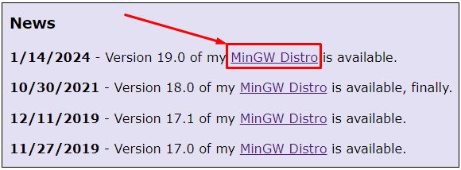
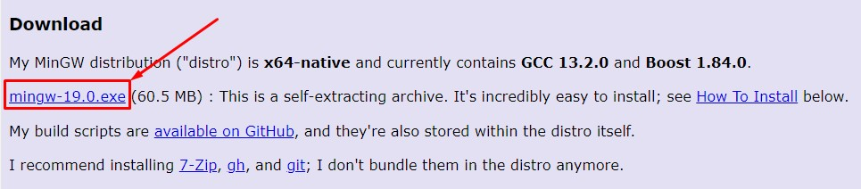
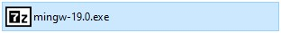
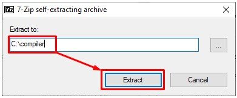
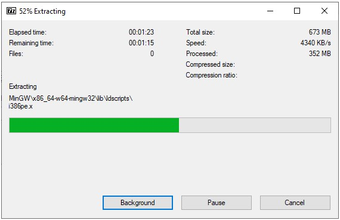
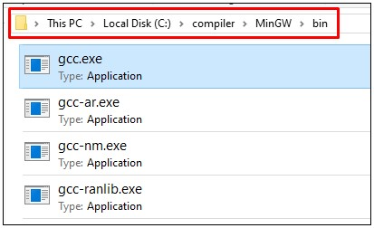
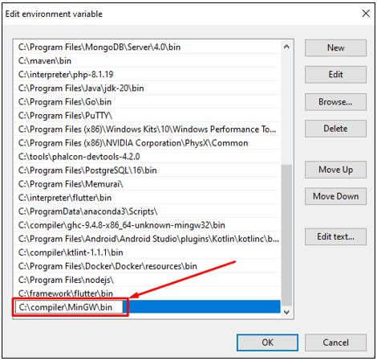
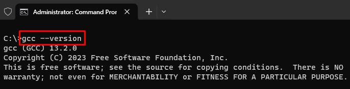

# MinGW

1. Silahkan unduh MinGW, melalui link berikut: [https://nuwen.net/](https://nuwen.net/)

2. Setelah berada dihalaman unduh MinGW. Selanjutnya pada bagian `News` silahkan pilih pada versi `MinGW` terbaru. Dalam kasus ini versi terbaru adalah `19.0`.

   

3. Akan tampil halaman untuk mengunduh MinGW sesuai dengan versi yang dipilih sebelumnya. Dalam kasus ini akan mengunduh MinGW versi `19.0` oleh karena itu pilih pada `mingw-19.0.exe` .

   

4. Buka lokasi tempat kamu mengunduh setup installer MinGW, kemudian double klik pada setup installer tersebut. 

   

5. Akan tampil dialog untuk memilih lokasi tempat melakukan ekstrat MinGW. Silahkan tempatkan pada lokasi `C:\compiler`. Setelah itu pilih pada tombol `Extract`.

   

6. Tunggu sampai proses ekstrat MinGW selesai.

   

7. Setelah selesai melakukan ekstrat MinGW. Silahkan buka lokasi `C:\compiler\MinGW\bin` maka akan terdapat program compiler `gcc.exe`.

   

8. Silahkan tambahkan lokasi compiler gcc ke Windows path environment. Lokasi compiler berada di lokasi `C:\compiler\MinGW\bin`. Lihat cara menambahkan lokasi program ke [Windows Path Environment](../tutorial/windows/path-environment.md).

   

9. Setelah menambahkan compiler gcc ke Windows path environemt. Selanjutnya buka `Windows Terminal` dan tuliskan perintah `gcc --version`. Jika berhasil maka akan tampil versi dari compiler gcc yang digunakan. Selamat sekarang kamu telah berhasil melakukan instalasi compiler gcc.

   
