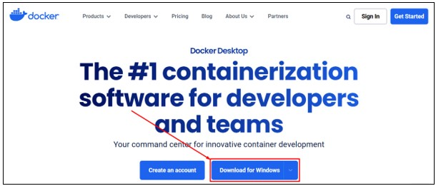

# Docker

1. Silahkan unduh Docker, melalui link berikut: [https://www.docker.com/products/docker-desktop/](https://www.docker.com/products/docker-desktop/)

2. Setelah berada dihalaman unduh Docker, silahkan pilih pada tombol `Download for Windows`. Sesuaikan dengan sistem operasi yang digunakan. Dalam kasus ini menggunakan sistem operasi Windows.

   

3. Buka lokasi tempat kamu mengunduh setup installer Docker, kemudian double klik pada setup installer tersebut.

   

4. Akan tampil proses instalasi Docker, tunggu sampai proses instalasi tersebut selesai.

   

5. Setelah proses instalasi selesai, silahkan pilih tombol `Close and restart`.

   

6. Pada sistem operasi Windows silahkan cari dan pilih pada aplikasi `Docker Desktop`.

   

7. Jika terdapat tampilan seperti berikut, silahkan memilih opsi `Use recommended settings...`. Setelah itu pilih tombol `Finish`.

   
   
7. Jika berhasil maka akan tampil jendela dari `docker desktop`. Selamat kamu telah berhasil melakukan instalasi Docker.

   
