# MongoDB

1. Silahkan unduh MongoDB, melalui link berikut: [https://www.mongodb.com/try/download/community](https://www.mongodb.com/try/download/community)

2. Setelah berada dihalaman unduh MongoDB, pada bagian `MongoDB Community Server Download` silahkan pilih pada tombol `Select Package`.

   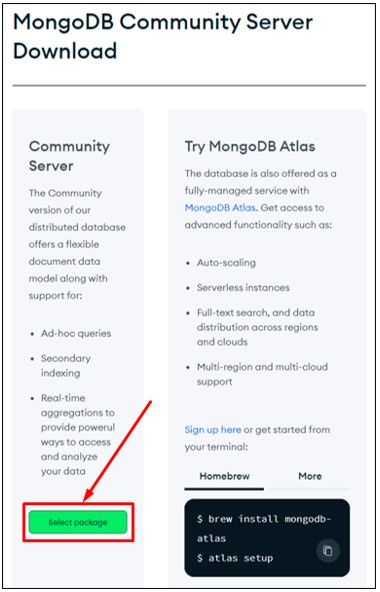

3. Akan tampil opsi untuk memilih versi MongoDB yang ingin diunduh. Pada bagian `Version` silahkan memilih versi `current` dalam kasus ini versi `current` yang tersedia adalah `7.0.5`. Dalam kasus ini juga menggunakan sistem operasi Windows oleh karena itu pada bagian `Platform` dipilih `Windows x64`. Pada bagian package pilih `msi` jika menggunakan sistem operasi Windows. Setelah itu pilih tombol `Download`.

   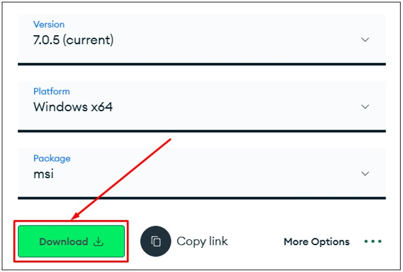

4. Buka lokasi tempat kamu mengunduh setup MongoDB, kemudian double klik pada setup installer tersebut.

   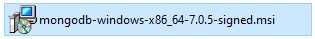

5. Akan tampil jendela Welcome. Selanjutnya pilih tombol `Next`.

   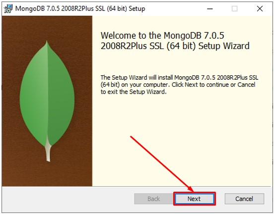

6. Akan tampil jendela perjanjian lisensi. Selanjutnya centang pada opsi `I accept the terms...`. Setelah itu pilih tombol `Next`.

   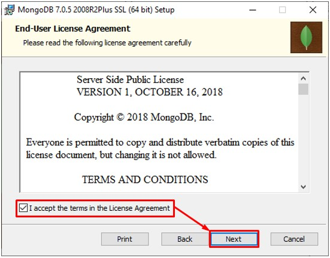

7. Akan tampil jendela untuk memilih setup type. Selanjutnya pilih pada tombol `Complete`.

   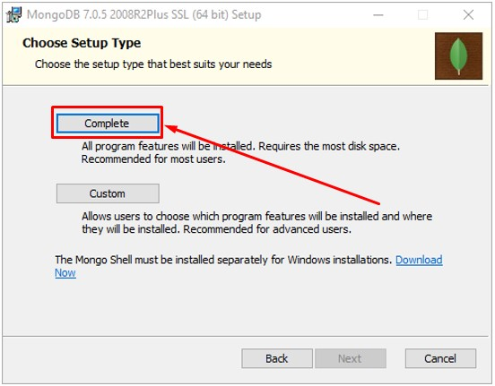

8. Akan tampil jendela konfigurasi servis. Selanjutnya centang pada opsi `Install MongoDB as a Service` dan pilih opsi `Run service as Network Service user`. Selanjutnya pada kotak isian `Service Name`, `Data Directory` dan `Log Directory` biarkan dengan nilai default. Setelah itu pilih tombol `Next`.

   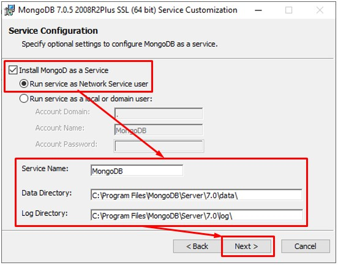

9. Akan tampil jendela opsi untuk menyertakan MongoDB Compass. Selanjutnya centang pada opsi `Install MongoDB Compass`. Setelah itu pilih pada tombol `Next`.

    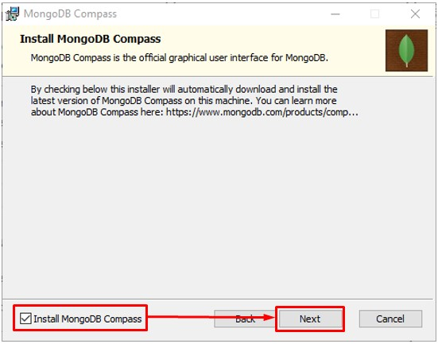
    
10. Akan tampil jendela untuk menginformasikan siap melakukan instalasi. Selanjutnya pilih pada tombol `Install`.

    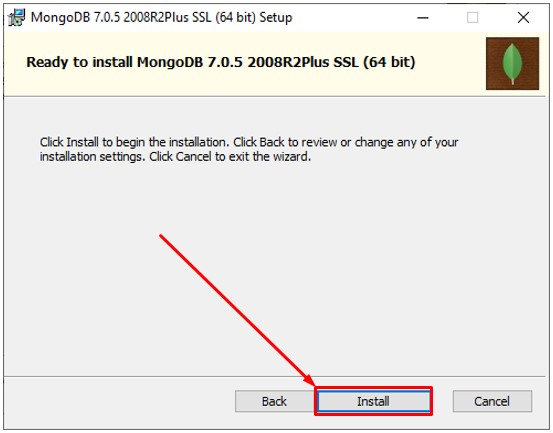
    
11. Tunggu sampai proses instalasi selesai.

    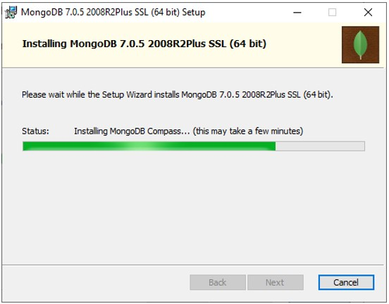
    
12. Setelah proses instalasi selesai. Selanjutnya pilih pada tombol `Finish`.

    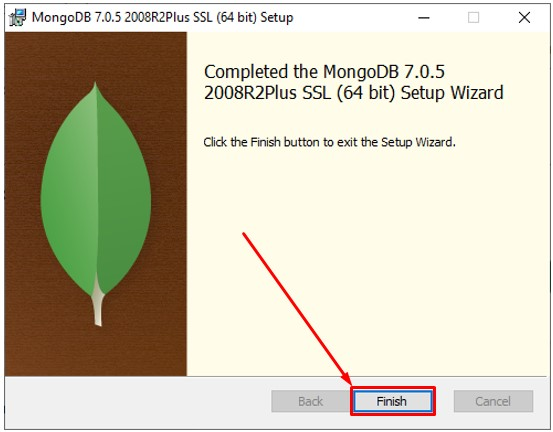
    
13. Akan terbuka MongoDB Compass secara otomatis jika proses instalasi berhasil. Pada bagian URI biarkan sesuai dengan nilai default. Setelah itu pilih tombol `Connect`.

    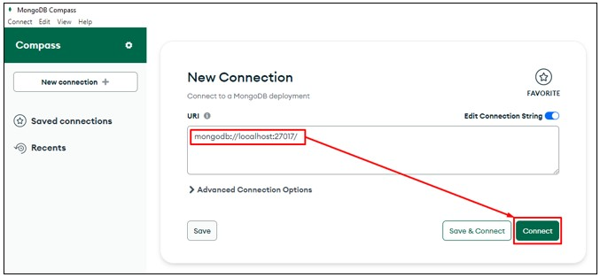
    
14. Jika berhasil maka sekarang berada dihalaman MongoDB Compass dan siap untuk mengoperasikan database. Selamat kamu telah berhasil melakukan instalasi MongoDB.

    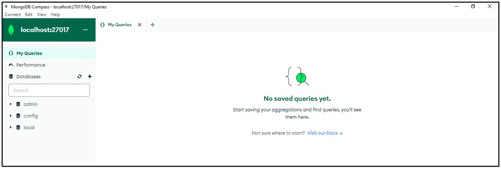