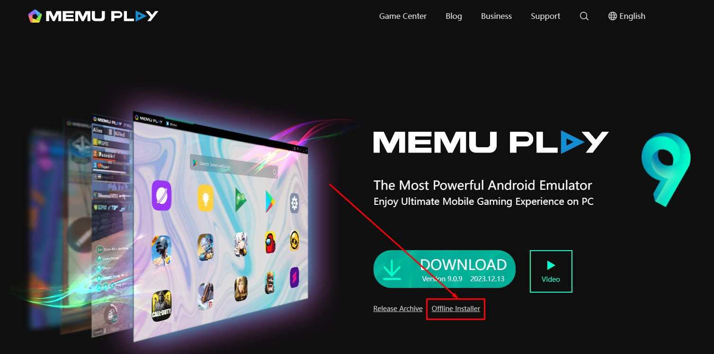
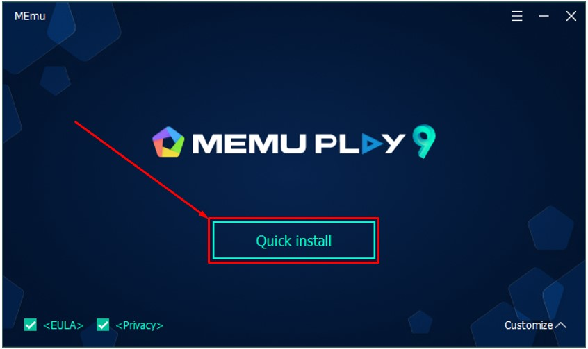
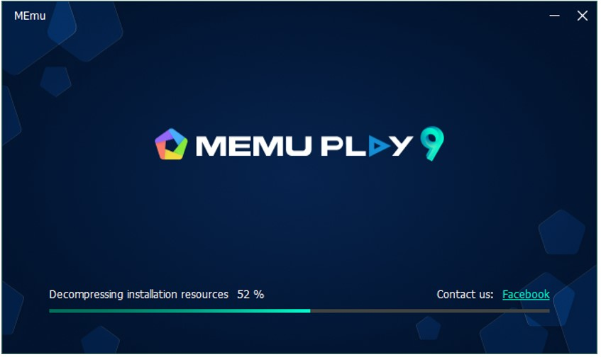
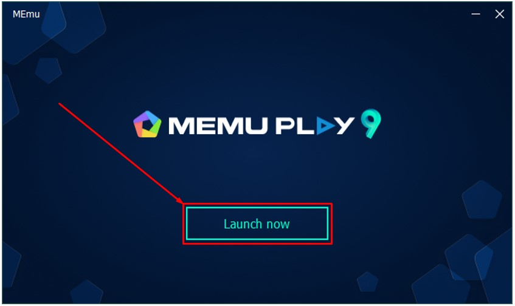
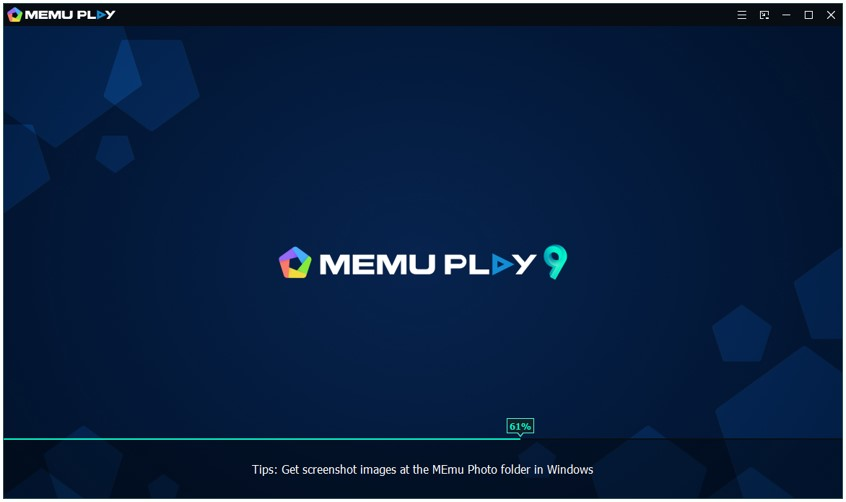
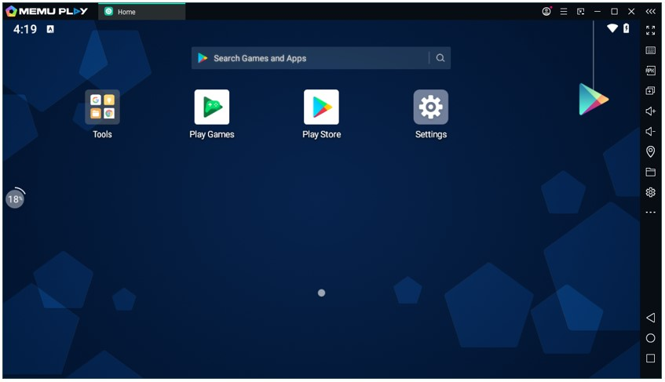

# Memu : Android Emulator

1. Silahkan unduh Memu, melalui link berikut: [https://www.memuplay.com/download.html](https://www.memuplay.com/download.html)

2. Setelah berada dihalaman unduh Memu, pilih pada opsi `Offline Installer`.

   

3. Buka lokasi tempat kamu mengunduh setup installer Memu, kemudian double klik pada setup installer tersebut.

   

4. Akan tampil jendela beriku. Selanjutnya pilih pada tombol `Quick Install`.

   

5. Tunggu sampai proses instalasi Memu selesai.

   

6. Setelah proses instalasi selesai. Selanjutnya pilih pada tombol `Launch now`.

   

7. Tunggu sampai proses memuat aplikasi Memu selesai.

   

8. Jika berhasil maka akan tampil halaman Memu. Selamat kamu telah berhasil melakukan instalasi Memu.

   

