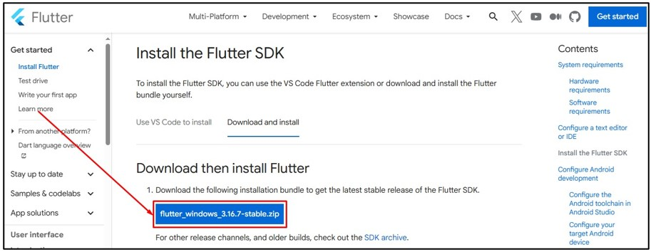
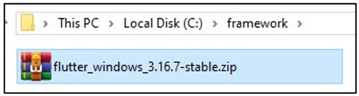
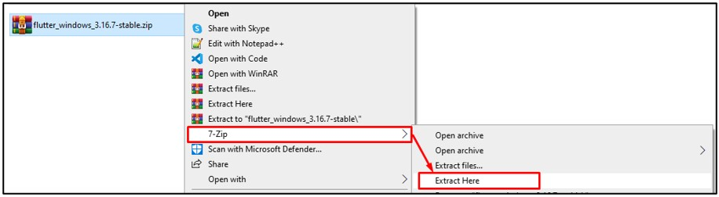
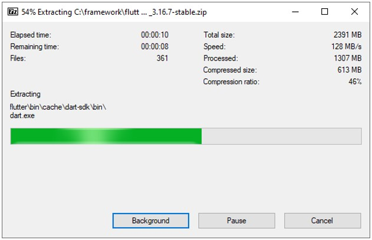
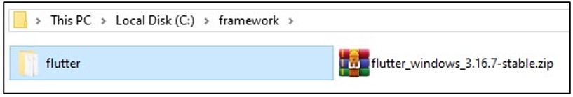
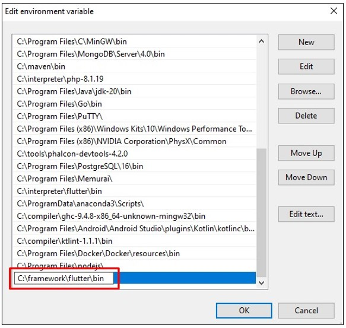
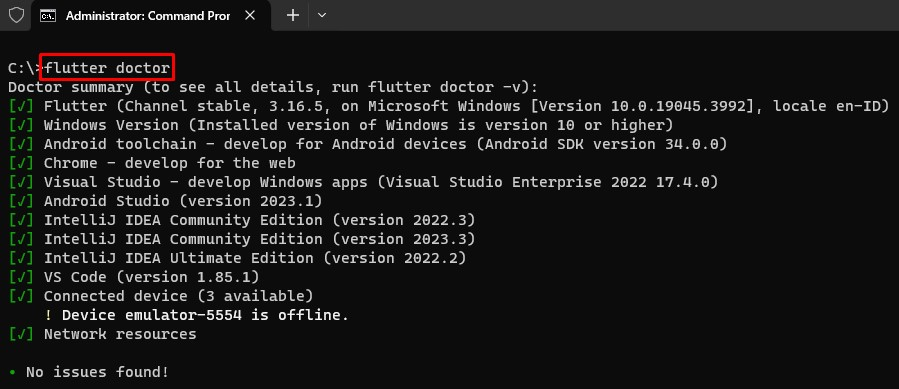
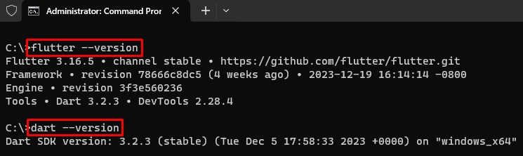

# Flutter

1. Silahkan melakukan instalasi program 7-Zip terlebih dahulu dengan mengikuti tahapan berikut ini: [Instalasi 7-Zip](../archive/1.7zip.md)

2. Silahkan unduh Flutter, melalui link berikut: [https://docs.flutter.dev/get-started/install/windows/mobile?tab=download](https://docs.flutter.dev/get-started/install/windows/mobile?tab=download)

3. Setelah berada di halaman unduh Flutter, pada bagian `Download then install Flutter` pilih pada tombol `flutter_windows_3.16.7-stable.zip`. Sesuaikan dengan versi yang tersedia. Pada saat modul ini dibuat versi yang tersedia adalah `3.16.7`.

   

4. Setelah selesai mengunduh, silahkan memindahkan file arsip flutter ke lokasi yang aman. Dalam kasus ini lokasi yang dipilih adalah `C:\framework\`.

   

5. Klik kanan pada file arsip flutter. Akan tampil context menu, silahkan pilih menu `7-Zip` selanjutnya pilih menu `Extract Here`. 

   

6. Tunggu sampai proses ekstraksi flutter selesai.

   

7. Setelah proses ekstraksi selesai akan terdapat folder baru bernama `flutter`.

   

8. Silahkan tambahkan lokasi flutter tersebut ke Windows path environment. Program flutter berada di lokasi `C:\framework\flutter\bin`. Lihat cara menambahkan lokasi program ke [Windows Path Environment](../tutorial/windows/path-environment.md)

   

9. Buka Windows Terminal. Selanjutnya tuliskan perintah `flutter doctor` untuk memeriksa konfigurasi sistem Anda dan memastikan bahwa Anda memiliki semua dependensi yang diperlukan untuk mengembangkan aplikasi dengan Flutter. Pastikan tidak terdapat issues saat menjalankan perintah tersebut.

   

10. Masih di Windows Terminal silahkan tuliskan perintah `flutter --version` dan `dart --version`. Jika berhasil maka akan tampil versi flutter dan dart yang digunakan. Selamat kamu telah berhasil melakukan instalasi Flutter.

   
