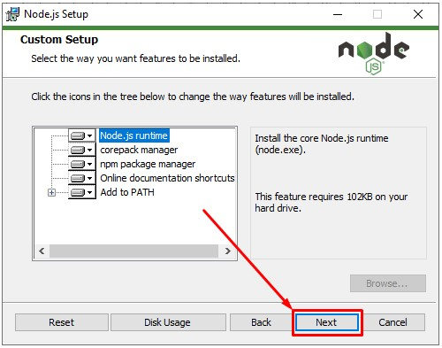

# Node.js

1. Silahkan unduh Node.js, melalui link berikut: [https://nodejs.org/en](https://nodejs.org/en)

2. Setelah berada dihalaman unduh Node.js, pada bagian `Download Node.js` silahkan pilih pada tombol `Recommended For Most User` yaitu versi LTS. Pada saat modul ini dibuat  versi LTS terbaru adalah `20.11.0`.

   

3. Buka lokasi tempat kamu mengunduh setup Node.js, kemudian double klik pada setup installer tersebut.

   
   
4. Akan tampil jendela Welcome, selanjutnya silahkan pilih tombol `Next`.

   
   
5. Akan tampil jendela perjanjian lisensi. Silahkan centang pada opsi `I accept the terms...`, setelah itu pilih tombol `Next`.

   
   
6. Akan tampil jendela untuk memilih lokasi tempat Node.js akan diinstal. Biarkan saja dilokasi default `C:\Program Files\nodejs\` setelah itu pilih tombol `Next`.

   
   
7. Akan tampil jendela seperti berikut, selanjutnya pilih tombol `Next`.

   
   
8. Akan tampil jendela seperti berikut, selanjutnya pilih tombol `Next`.

   
   
9. Akan tampil jendela yang menginformasikan jika Node.js siap untuk diinstal, selanjutnya pilih tombol `Install`.

   
   
10. Tunggu sampai proses instalasi selesai.

   

11. Setelah proses instalasi selesai, selanjutnya pilih tombol `Finish`. 

   

12. Buka `Windows Terminal` selanjutnya tuliskan perintah `node -v` dan `npm -v` untuk melihat versi Node.js dan versi `Node Package Manager (NPM)` yang telah terpasang. Selamat kamu telah berhasil melakukan instalasi Node.js

   