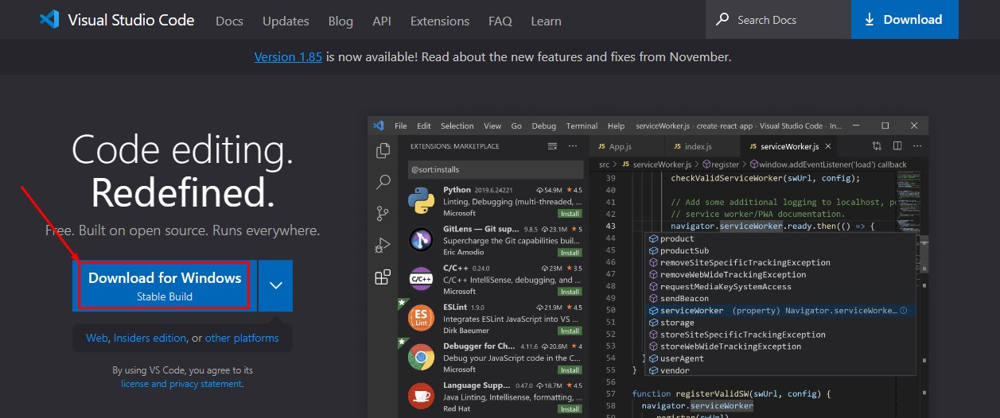
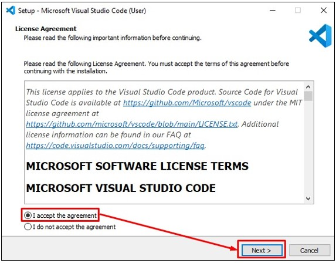
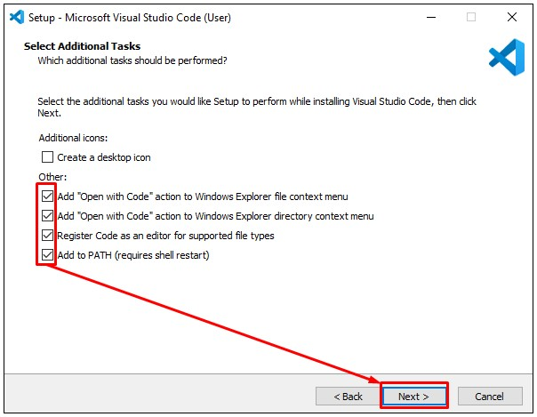
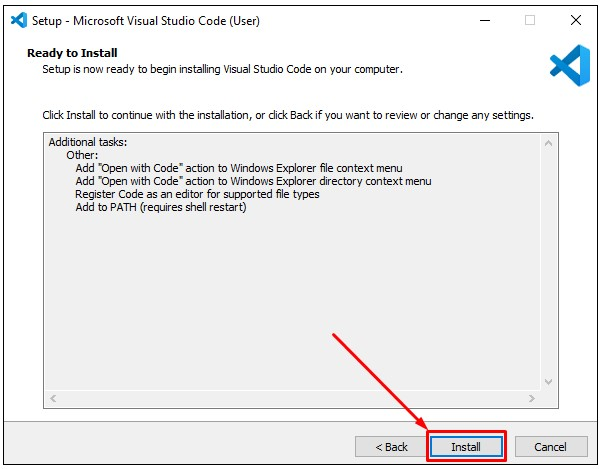
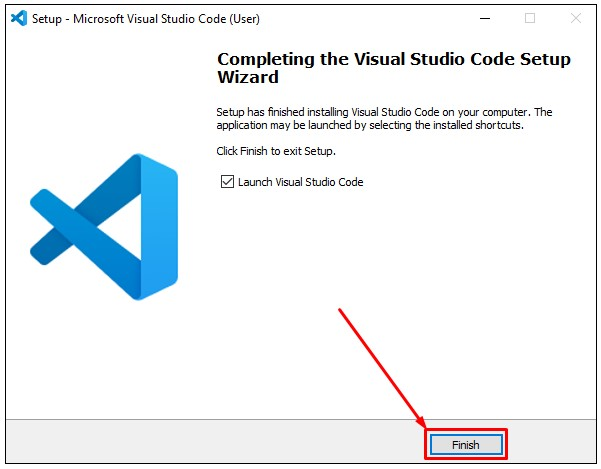
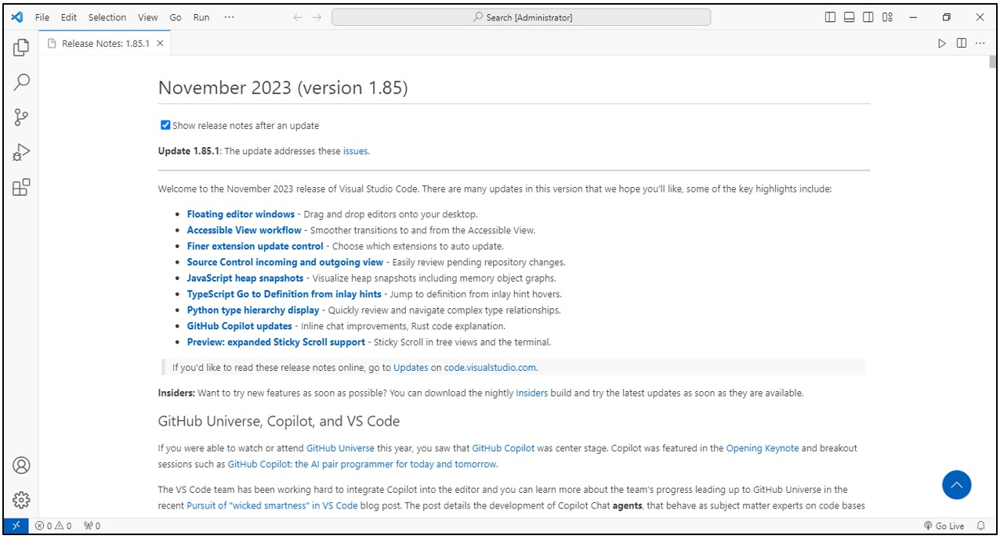

# Visual Studio Code

1. Silahkan unduh VSCode, melalui link berikut: [https://code.visualstudio.com](https://code.visualstudio.com/)
2. Setelah berada dihalaman unduh VSCode, pilih tombol `Download`. 

	

3. Buka lokasi tempat kamu mengunduh setup installer VSCode, kemudian double klik pada setup installer tersebut. 

	
	
4. Akan tampil jendela perjanjian lisensi penggunaan aplikasi, pilih opsi `I accept for agreement`, kemudian pilih tombol `Next`.

	

5. Akan tampil jendela opsi tambahan yang mungkin kita butuhkan sebelum insalasi VSCode. Pilih semua opsi pada bagian other, kemudian pilih tombol `Next`.

	

6. Akan tampil jendela untuk memberitahukan bahwa aplikasi VSCode siap untuk diinstal. Pilih tombol `Install`.

	

7. Tunggu sampai proses instalasi selesai, setelah selesai, pilih tombol `Finish`.

	

8. Selamat sekarang kamu telah berhasil melakukan instalasi VSCode.

	