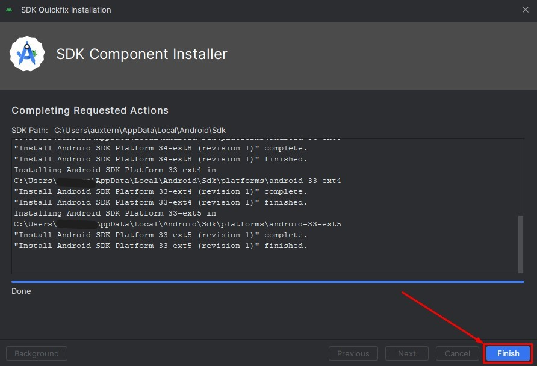

# Android Studio

1. Silahkan unduh Android Studio, melalui link berikut: [https://developer.android.com/studio](https://developer.android.com/studio?hl=en)
	
2. Setelah berada dihalaman unduh Android Studio, pilih tombol `Download Android Studio`, nama versi saat modul ini dibuat adalah `Hedgehog` dan dapat berubah sewaktu-waktu.

	
	
3. Akan tampil dialog kebijakan layanan, scrool sampai ke tampilan paling bawah selanjutnya centang pada opsi `I have read and agree...` setelah itu pilih tombol `Download Android Studio`.

	

4. Buka lokasi tempat kamu mengunduh setup installer Android Studio, kemudian double klik pada setup installer tersebut. 

	
	
5. Akan tampil jendela Welcome, selanjutnya pilih pada tombol `Next`.

	
	
6. Akan tampil jendela untuk memilih komponen tambahan. Silahkan centang pada opsi `Android Virtual Device` jika dirasa spesifikasi dari laptop yang digunakan sanggup, jika tidak jangan centang opsi ini. Setelah itu pilih tombol `Next`.

	
	
7. Akan tampil jendela untuk memilih lokasi tempat Android Studio diinstall, biarkan saja dilokasi bawaan. Setelah itu pilih tombol `Next`.

	
	
8. Akan tampil jendela untuk memilih folder start menu, biarkan saja sesuai nilai bawaan. Setelah itu pilih tombol `Install`.

	
	
9. Tunggu sampai proses instalasi Android Studio selesai.

	
	
10. Setelah proses instalasi selesai, selanjutnya pilih tombol `Next`.

	
	
11. Akan tampil jendela untuk menginformasikan bahwa Android Studio telah selesai diinstal. Setelah itu centang opsi `Start Android Studio` kemudian pilih tombol `Finish`.

	
	
12. Akan Tampil loading Android Studio dengan nama versi Hedgehog.

	
	
18. Pada tampilan Welcome Android Studio, pilih `More Actions` setelah itu pilih menu `SDK Manager`.

	
	
19. Akan terbuka menu `Android SDK` di dalam bagian `Language & Framework`. Setelah itu centang opsi dari `Android 7` sampai `Android 12`.

	
	
20. Masih di menu `Android SDK` selanjutnya pilih tab `SDK Tools` kemudian scrool dan centang semua opsi yang tersedia. Setelah itu pilih tombol `Apply`.

	
	
21. Akan tampil dialog konfirmasi untuk melakukan instalasi package tambahan yang telah dicentang sebelumnya. Selanjutnya pilih tombol `Ok`. 

	
	
22. Tunggu sampai proses instalasi keseluruhan package selesai. Proses ini mungkin membutuhkan waktu yang sangat lama.

	

23. Setelah proses instalasi selesai, selanjutnya pilih tombol `Finish`.

	

24. Pada tampilan `SDK Tools` selanjutnya pilih tombol `Ok`.

	

25. Selamat sekarang kamu telah berhasil melakukan instalasi Android Studio.

	