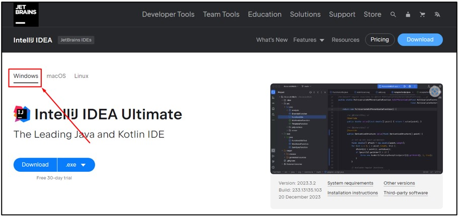
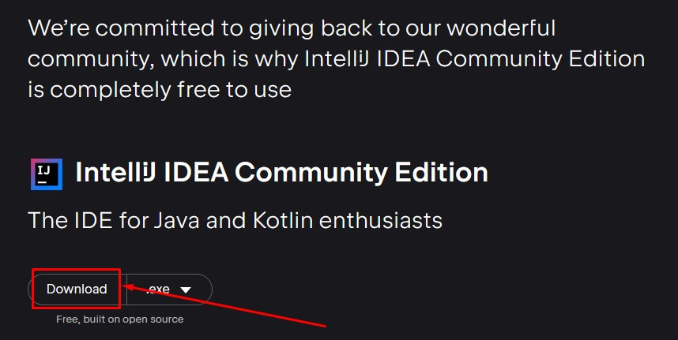
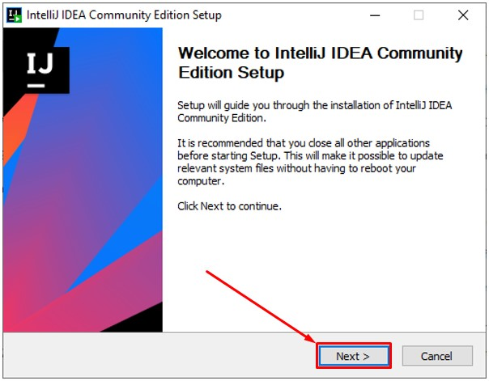
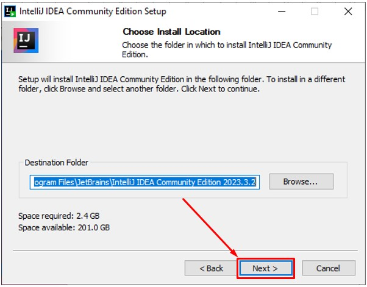
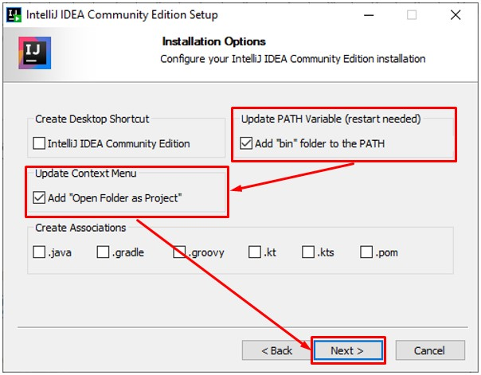
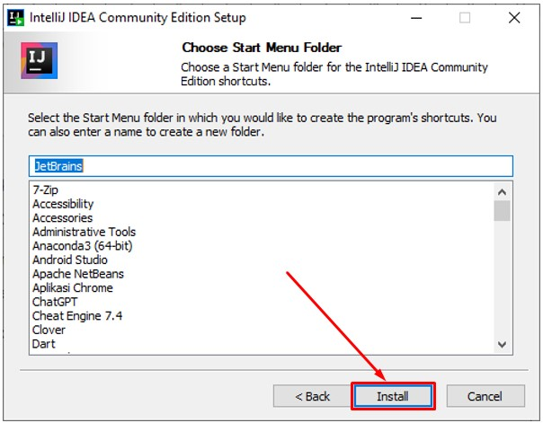
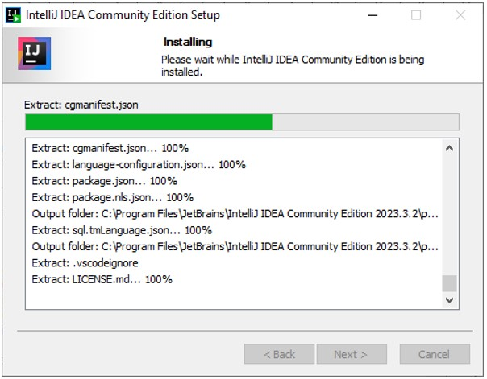
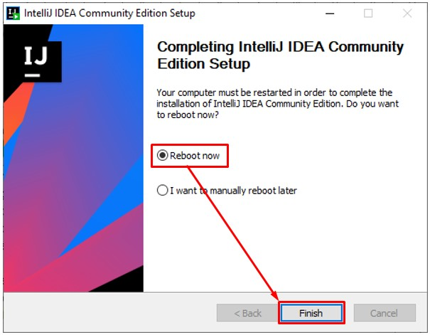
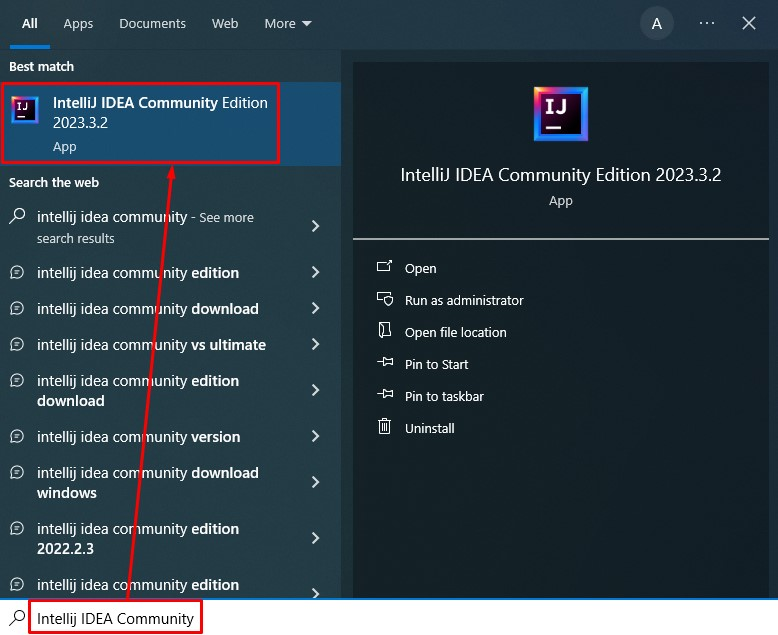
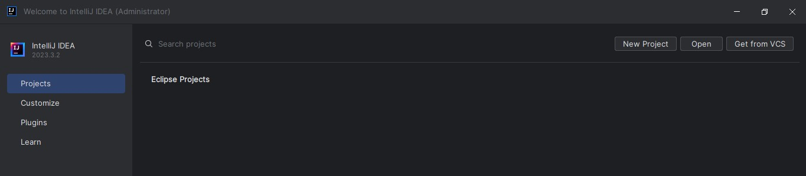

# Intellij IDEA

1. Silahkan unduh Intellij IDEA, melalui link berikut: [https://www.jetbrains.com/idea/download](https://www.jetbrains.com/idea/download)

2. Setelah berada dihalaman unduh Intellij IDEA, pilih tab Windows. Dalam kasus ini menggunakan sistem operasi Windows.

   

3. Scrool ke bawah hingga pada bagian `Intellij IDEA Community Edition` pilih tombol `Download`. Harap dicatat bukan di bagian `Intellij IDEA Ultimate` karena versi tersebut berbayar.

   

4. Buka lokasi tempat kamu mengunduh setup installer VSCode, kemudian double klik pada setup installer tersebut. 

   

5. Akan tampil jendela Welcome. Selanjutnya pilih tombol `Next`.

   

6. Akan tampil jendela untuk memilih lokasi instalasi, biarkan saja berisi nilai default. Selanjutnya pilih tombol `Next`.

   

7. Akan tampil jendela opsi instalasi. Pada bagian `Update PATH variable` silahkan centang pada opsi `Add "bin" folder to the PATH`, selanjutnya pada bagian `Update Context Menu` silahkan centang pada opsi `Add "Open Folder as Project"`. Setelah itu pilih tombol `Next`.

   

8. Akan tampil jendela berikut. Selanjutnya pilih tombol `Install`.

   
   
9. Tunggu sampai proses instalasi selesai.

   
   
10. Setelah proses instalasi selesai, silahkan pilih pada opsi `Reboot now`. Setelah itu pilih tombol Finish.

	
	
11. Tunggu sampai proses restart selesai.

12. Pada sistem operasi Windows cari dan pilih pada `Intellij IDEA Community`.

	
	
13. Berikut merupakan tampilan Welcome dari Intellij IDEA. Selamat kamu telah berhasil melakukan instalasi Intellij IDEA.

	
