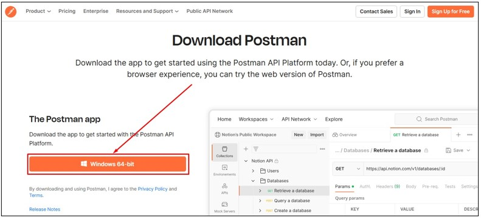
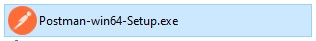
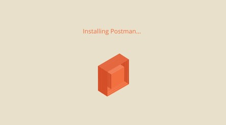
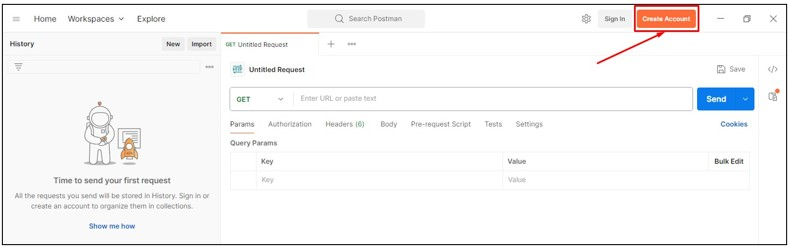
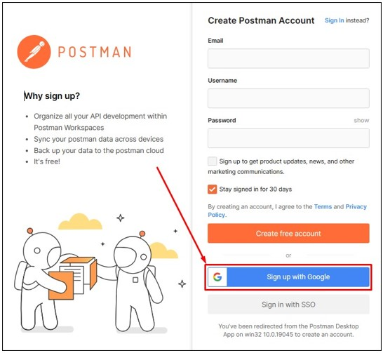
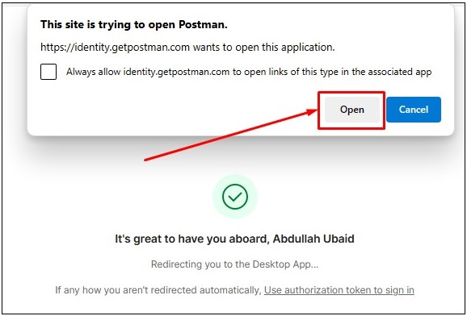
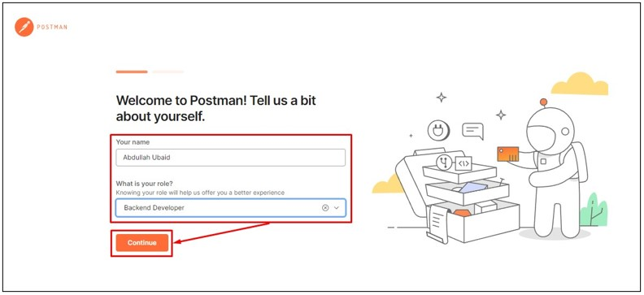
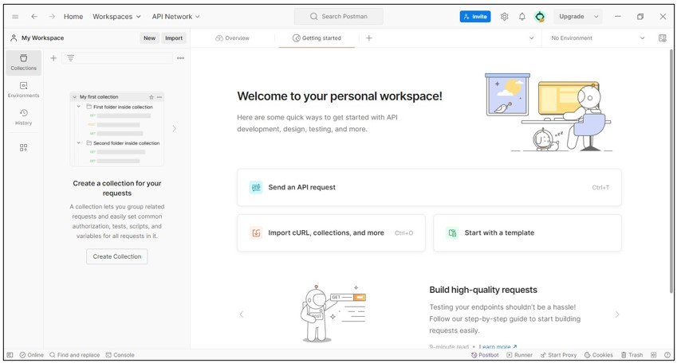

# Postman

1. Silahkan unduh Node.js, melalui link berikut: [https://www.postman.com/downloads/](https://www.postman.com/downloads/)

2. Setelah berada dihalaman unduh Postman, silahkan pilih pada tombol `Windows 64-bit`. Dalam kasus ini menggunakan sistem operasi Windows.

   

3. Buka lokasi tempat kamu mengunduh setup Postman, kemudian double klik pada setup installer tersebut.

   
   
4. Tunggu sampai proses instalasi selesai.

   
   
5. Setelah proses instalasi selesai akan terbuka tampilan Postman, silahkan pilih pada tombol `Create Account`.

   
   
6. Akan terbuka halaman pendaftaran postman pada web browser. Silahkan pilih pada tombol `Sign Up with Google`.

   

7. Silahkan memilih salah satu akun Google yang akan digunakan untuk melakukan pendaftaran akun Postman.

8. Jika berhasil akan tampil dialog seperti berikut. Selanjutnya pilih pada tombol `Open`.

   
   
9. Akan tampil jendela Welcome to Postman. Selanjutnya silahkan pada kotak isian `Your name` isi sesuai dengan nama kamu, selanjutnya pada dropdown `What is your role?` pilih sesuai dengan role kamu. Setelah selesai pilih pada tombol `Continue`.

   
   
10. Berikut adalah tampilan dari aplikasi Postman. Selamat kamu telah berhasil melakukan instalasi Postman.

	