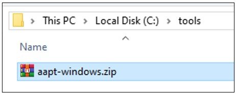

# AAPT (Android Asset Packaging Tool)

1. Silahkan melakukan instalasi program 7-Zip terlebih dahulu dengan mengikuti tahapan berikut ini: [Instalasi 7-Zip](../archive/1.7zip.md)

2. Silahkan unduh AAPT, melalui link berikut: [https://aaptdownload.com/](https://aaptdownload.com/)

3. Setelah berada dihalaman unduh AAPT, silahkan pilih pada tombol `Windows`. Dalam kasus ini menggunakan sistem operasi Windows.

   

4. Setelah selesai melakukan unduh AAPT selanjutnya pindahkan file arsip AAPT ke lokasi `C:\tools`.

   

5. Selanjutnya ekstrat file AAPT dengan cara klik kanan pada file arsip AAPT, maka akan tampil context menu kemudian pilih pada menu `7-Zip > Extract to "aapt-windows\"`.

   

6. Jika berhasil melakukan ekstrat file arsip AAPT maka akan terdapat folder `aapt-windows`. Silahkan pilih pada folder tersebut.

   

7. Akan terdapat program `aapt.exe` di dalam folder tersebut.

   

9. Tambahkan lokasi program AAPT dari `C:\tools\aapt-windows` ke Path Environment. Lihat cara menambahkan lokasi ke [Path Environment](../tutorial/windows/path-environment.md).

   

10. Selanjutnya buka Windows Terminal dan tuliskan perintah `aapt version`. Jika berhasil maka akan tampil versi dari AAPT yang telah diunduh. Selamat kamu telah berhasil menambahkan AAPT ke environment Windows.

    
