# Android Device USB Debugging

1. Pada Android Device kamu silahkan buka aplikasi `Settings`.

	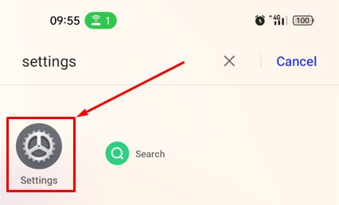

2. Pada tampilan `Settings`, scrool ke bawah kemudian cari dan pilih pada menu `About device`.

	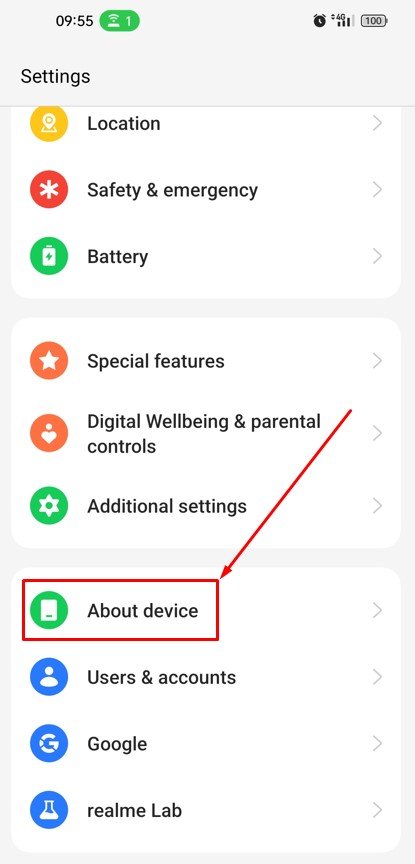

3. Pada tampilan `About device` silahkan pilih menu `Version`.

	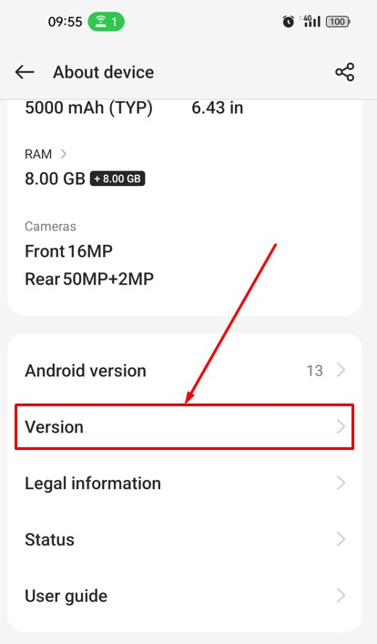

4. Pada tampilan `Version` silahkan sentuh menu `Build number`, sampai beberapa kali hingga tampil pesan `You are now in Developer mode!` di bagian bawah.

	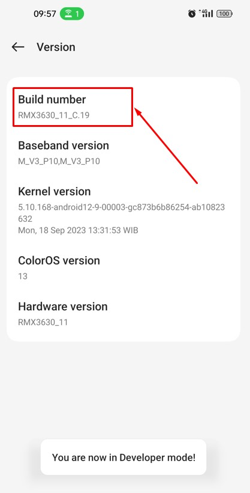

5. Buka `Play Store` selanjutnya cari dan install aplikasi `Developer Options` setelah selesai silahkan membuka aplikasi dengan memilih tombol `Open`.

	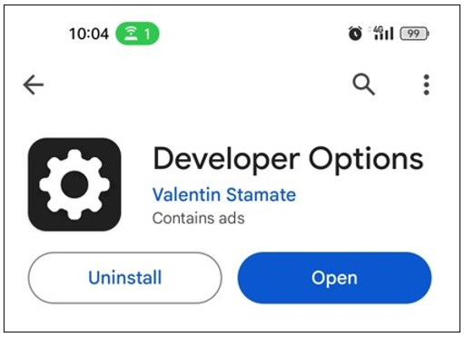

6. Pada tampilan aplikasi `Developer Options` silahkan memilih tombol `Developer Options`.

	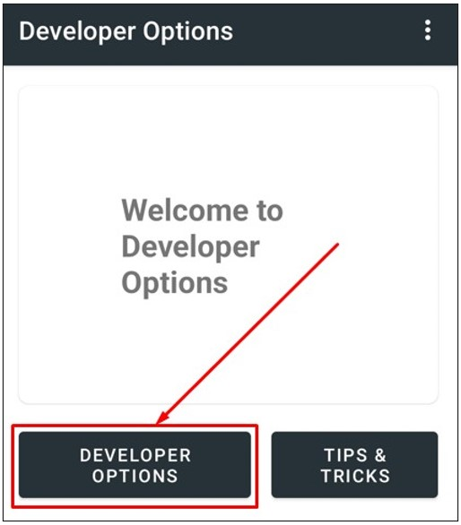

7. Akan terbuka tampilan `Developer options`. Perhatikan pada menu `Developer options` dimana opsi dalam keadaan `on` yang berarti Android Device kamu dalam mode Developer.

	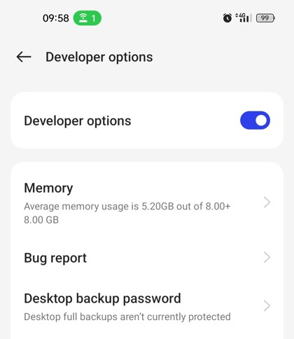

8. Silahkan membuka kembali proyek Android Studio yang pernah kamu buat sebelumnya.

	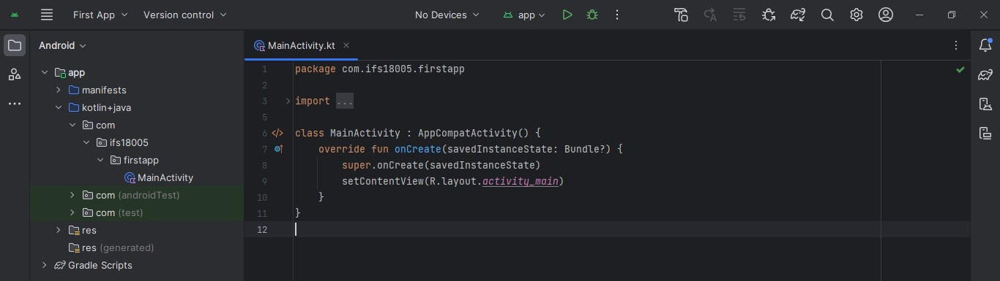
	
9. Setelah proyek berhasil terbuka silahkan menghubungkan Android Device kamu ke laptop menggunakan kabel USB.

	
	
10. Pada Device Android kamu, buka `Developer Options` selanjutnya scrool sampai ke bagian `Debugging` setelah itu pilih pada menu `USB debugging`.

	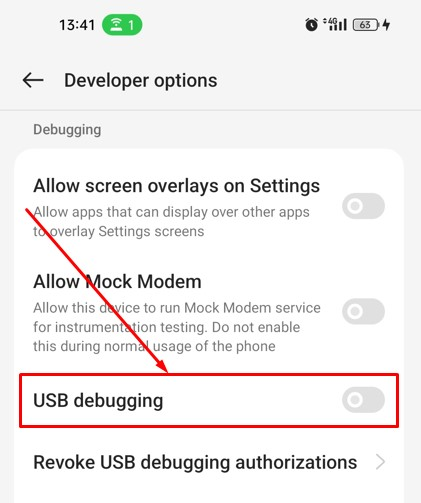
	
11. Akan tampil dialog peringatan. Selanjutnya pilih tombol `Ok`.

	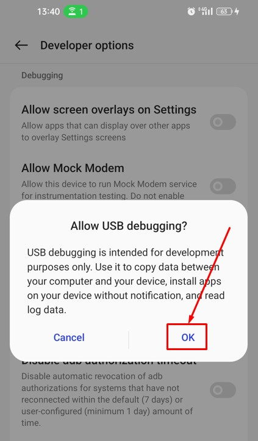
	
12. Jika berhasil maka pada menu `USB debugging` statusnya menjadi `on`.

	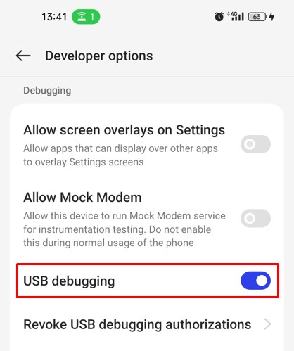
	
13. Jika koneksi antara Android Device kamu dengan laptop terhubung dengan baik menggunakan kabel USB maka secara otomatis akan terdapat dialog konfirmasi. Selanjutnya centang pada opsi `Always allow from this computer` setelah itu pilih tombol `Allow`.

	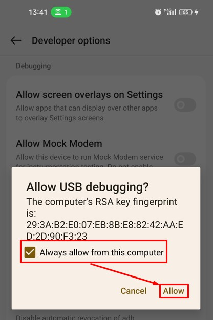
	
14. Pada proyek Android Studio, Android Device kamu akan terdeteksi dan dapat dipilih sebagai Device untuk menjalankan aplikasi yang sedang dikembangkan. Silahkan memilih Android Device kamu. Setelah itu pilih tombol `Run`.

	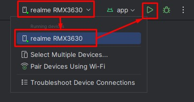
	
15. Ikon `Run` yang dipilih sebelumnya akan berubah menjadi `circle loading bar` dan kamu dapat melihat indikator proses build aplikasi pada bagian bawah di proyek Android Studio.

	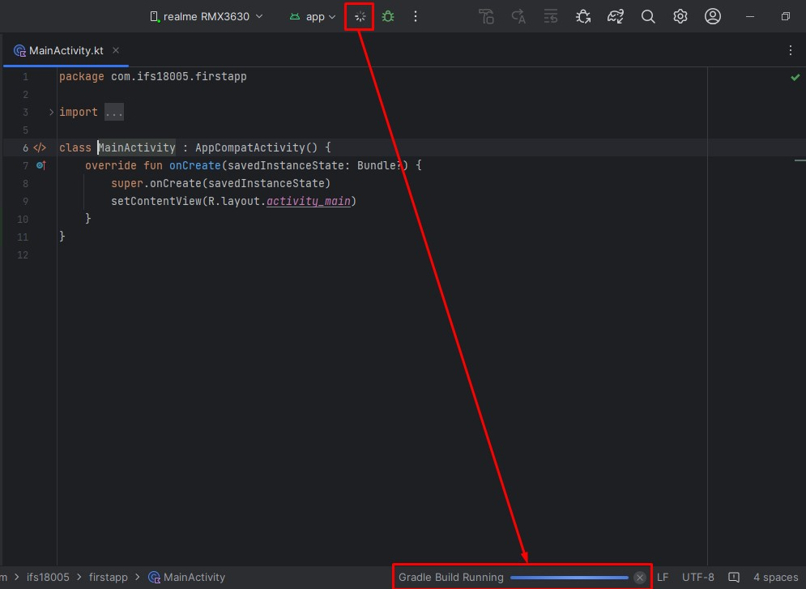

16. Jika proses build aplikasi telah selesai maka akan terdapat toast message, seperti berikut:

	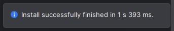
	
17. Maka pada Device Android kamu akan menampilkan text `Hello World` ini berarti Android Studio berhasil terinstall dengan baik. Selamat telah berhasil membuat dan menjalankan proyek Android pada Device Android kamu.

	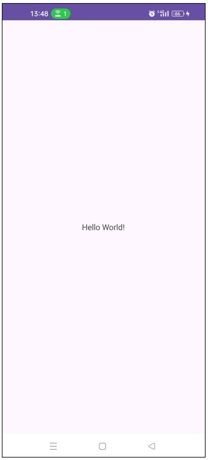