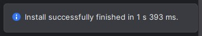

# Android Emulator : Memu

1. Silahkan membuka kembali proyek Android Studio yang pernah kamu buat sebelumnya.

   

2. Setelah proyek Android berhasil terbuka. Selanjutnya buka emulator Memu.

   
   
3. Tunggu sampai proses memuat emulator Memu selesai.

   
   
4. Akan tampil halaman dari emulator Memu.

   
   
5. Pada proyek Android Studio, emulator Memu akan terdeteksi dan dapat dipilih sebagai Device untuk menjalankan aplikasi yang sedang dikembangkan. Silahkan memilih emulator Memu tersebut. Setelah itu pilih tombol `Run`.

   

6. Ikon `Run` yang dipilih sebelumnya akan berubah menjadi `circle loading bar` dan kamu dapat melihat indikator proses build aplikasi pada bagian bawah di proyek Android Studio.

	

7. Jika proses build aplikasi telah selesai maka akan terdapat toast message, seperti berikut:

	
	
8. Jika berhasil maka pada emulator Memu kamu akan menampilkan text `Hello World`. Ini berarti Android Studio berhasil terinstall dengan baik. Selamat telah berhasil membuat dan menjalankan proyek Android pada emulator Memu. Ikuti tahapan berikutnya untuk mengubah tampilan emulator Memu menjadi `Potret`.

	
	
9. Pada toolbar emulator Memu dibagian sebelah kanan pilih ikon `Settings`.

	
	
10. Akan tampil jendela `System settings`. Selanjutnya pilih pada menu `Display`. Dibagian `Resolution` pilih pada opsi `Phone`. Selanjutnya pada dropdown resolusi layar pilih pada opsi `720 * 1280` (silahkan disesuaikan dengan resolusi terdekat). Setelah itu pilih tombol `Ok`.

	
	
11. Akan tampil dialog peringatan. Selanjutnya pilih pada tombol `Restart now`.

	
	
12. Tunggu sampai proses memuat emulator Memu selesai. Dapat dilihat bahwa loading emulator memu sudah menampilkan layar `Potret`.

	
	
13. Jika telah selesai memuat maka tampilan Memu sudah menjadi `Potret`.

	