# Android Studio : Create Virtual Device

1. Silahkan membuka kembali proyek Android Studio yang pernah kamu buat sebelumnya.

2. Setelah proyek terbuka selanjutnya pada toolbar di bagian sebelah kanan pilih ikon `Device Manager`.

   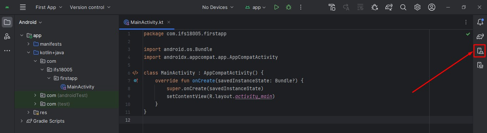

3. Akan tampil jendela `Device Manager` selanjutnya pilih ikon `+` untuk membuat Virtual Device baru.

	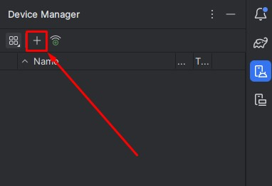
	
4. Akan tampil jendela `Select Hardware` silahkan cari dan pilih pada `Pixel 7 Pro`. Setelah itu pilih tombol `Next`.

	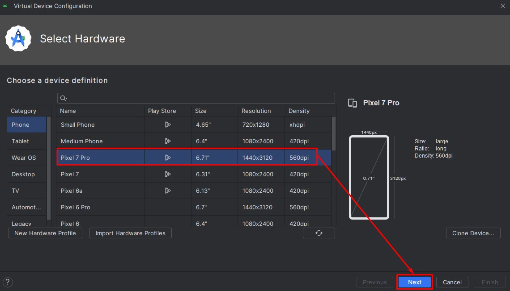
	
5. Akan tampil jendela `Select a system image`. Apabila tampilan versi Android memiliki warna yang redup itu berarti versi Android belum pernah diinstal sebelumnya.  Dalam kasus ini perhatikan border merah pada versi Android 9 (Pie) yang memiliki warna redup.

	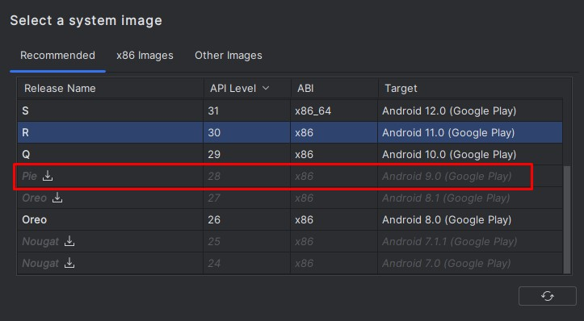
	
6. Dalam kasus ini kita akan membuat Virtual Device dengan versi Android 9 (Pie), tetapi versi Android ini belum terinstal. Oleh karena itu untuk menginstal versi Android ini silahkan pilih ikon `Download` yang berada disebelah kanan nama versi Android.

	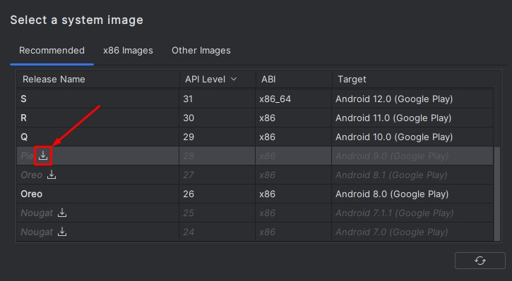
	
7. Akan tampil jendela untuk melakukan unduh versi Android sesuai dengan yang dipilih. Tunggu sampai proses instalasi selesai.

	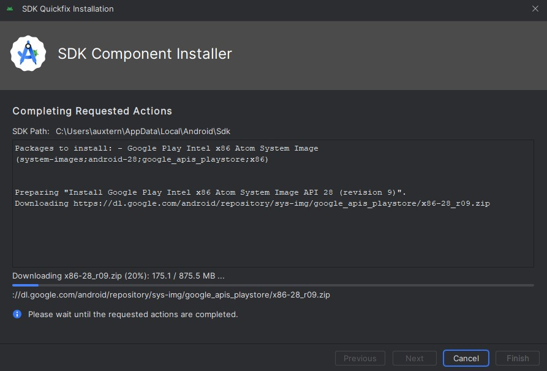
	
8. Setelah proses instalasi selesai selanjutnya pilih tombol `Finish`.

	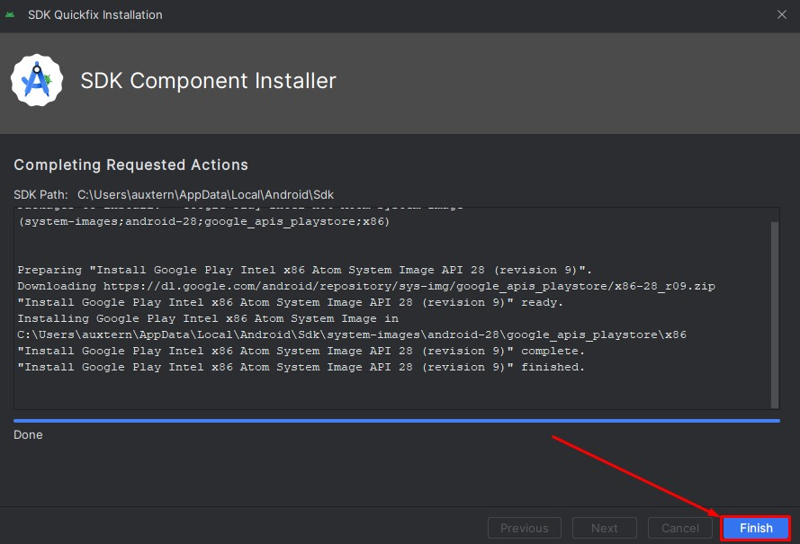

9. Sekarang versi Android 9 (Pie) memiliki warna yang cerah itu berarti versi Android ini telah berhasil terinstall. Selanjutnya pilih pada versi Android tersebut kemudian pilih tombol `Next`.

	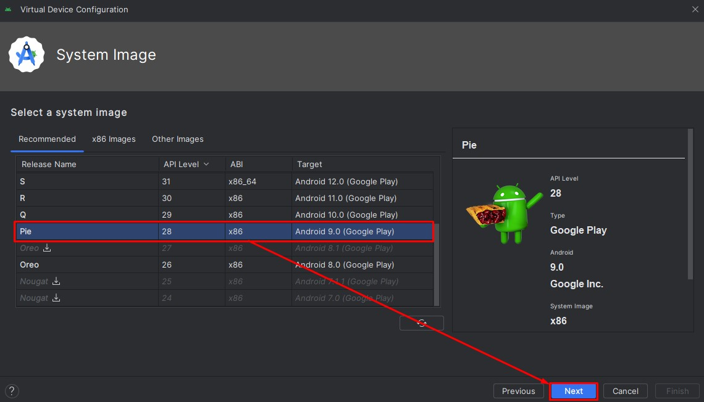
	
10. Silahkan melakukan pengaturan Android Virtual Device (AVD) sesuai dengan kebutuhan kamu. Untuk mengatur penggunaan jumlah ram dan storage yang digunakan silahkan memilih tombol `Show Advanced Settings` dan lakukan pengaturan sesuai kebutuhan. Setelah selesai melakukan pengaturan silahkan memilih tombol `Finish`.

	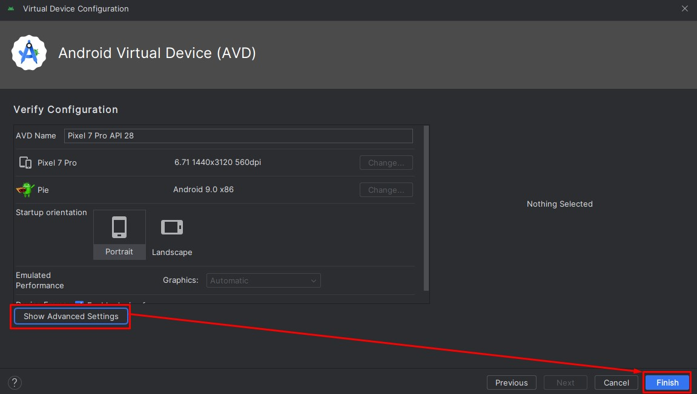
	
11. Sekarang pada tampilan Device Manager sudah terdapat Device baru dengan nama `Pixel 7 Pro API 28`. Selamat kamu telah berhasil membuat Virtual Device baru pada Android Studio.

	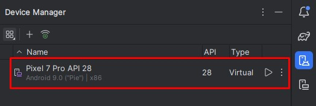
	
12. Untuk menjalankan Virtual Device silahkan memilih ikon `Play` pada AVD yang ingin dijalankan.

	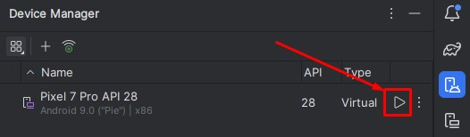
	
13. Tunggu beberapa saat sehingga tampilan Running Device terbuka dan menampilkan AVD sesuai dengan yang dijalankan sebelumnya.

	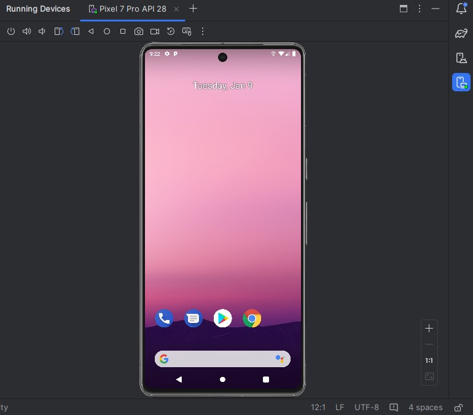
	
14. Pada proyek Android Studio, AVD akan terdeteksi dan dapat dipilih sebagai Device untuk menjalankan aplikasi yang sedang dikembangkan. Silahkan memilih AVD yang telah kamu jalankan sebelumnya. Setelah itu pilih tombol `Run`.

	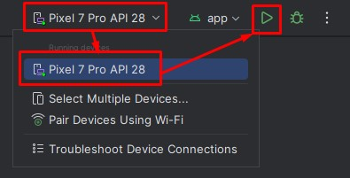
	
15. Ikon `Run` yang dipilih sebelumnya akan berubah menjadi `circle loading bar` dan kamu dapat melihat indikator proses build aplikasi pada bagian bawah di proyek Android Studio.

	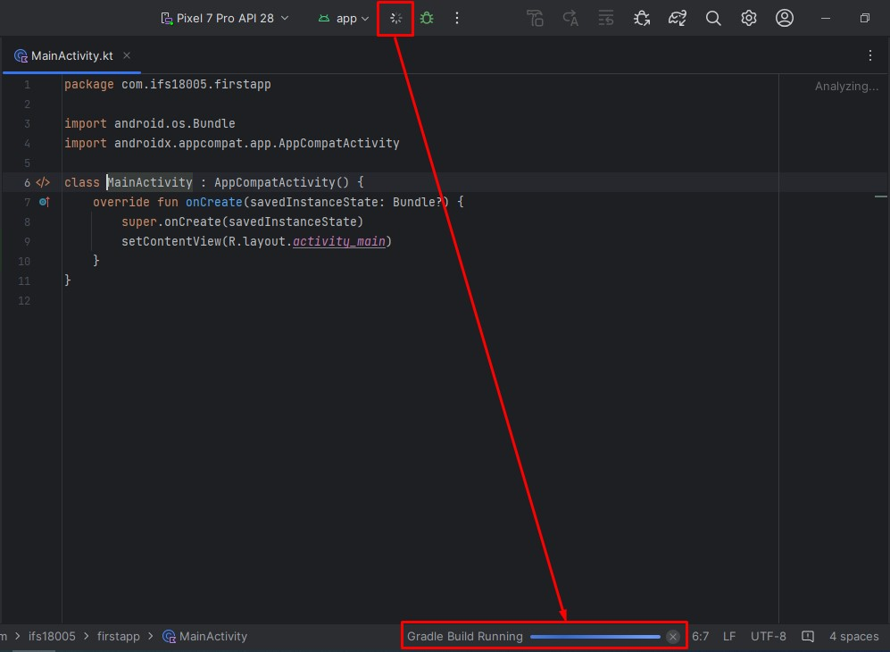
	
16. Jika proses build aplikasi telah selesai maka akan terdapat toast message, seperti berikut:

	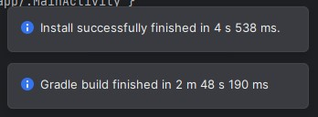
	
17. Tampilan Running Device akan terbuka dan pada AVD tempat aplikasi dijalankan akan menampilkan text `Hello World` ini berarti Android Studio dan AVD berhasil terinstall dengan baik. Selamat telah berhasil membuat dan menjalankan proyek Android pada AVD.

	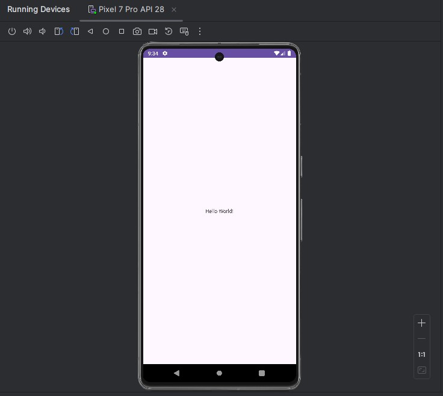