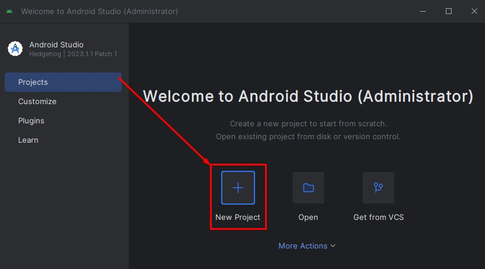
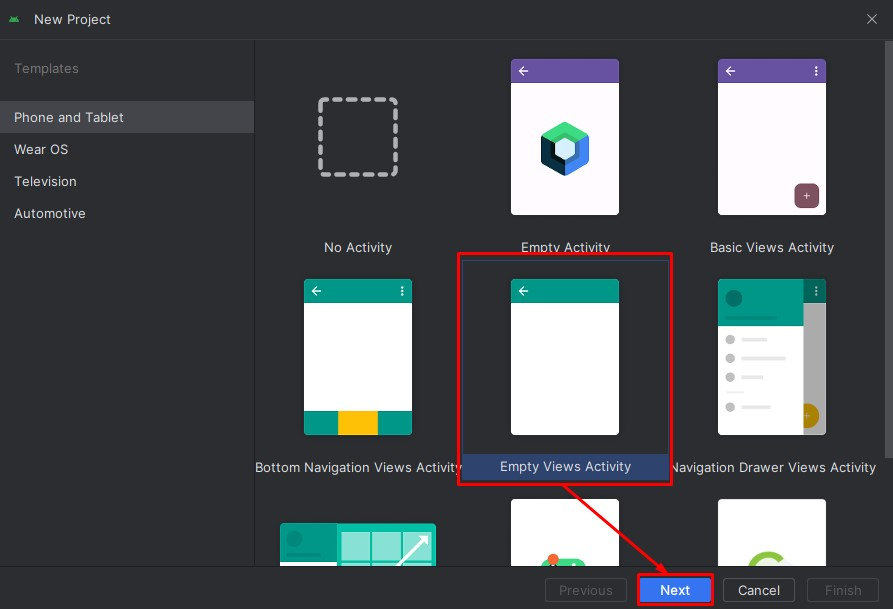
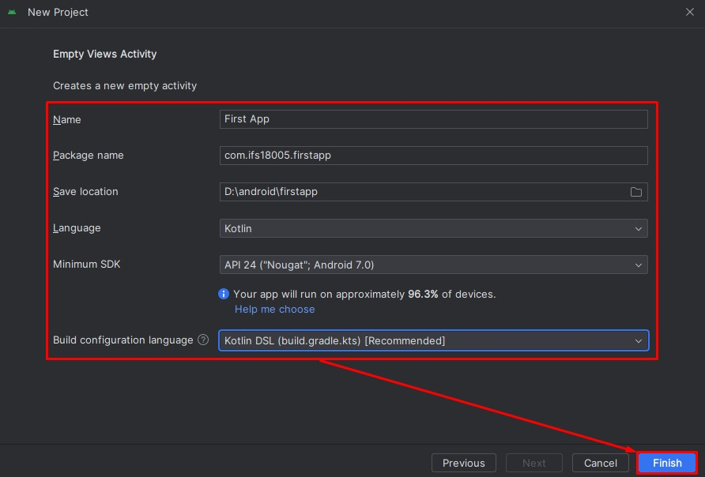
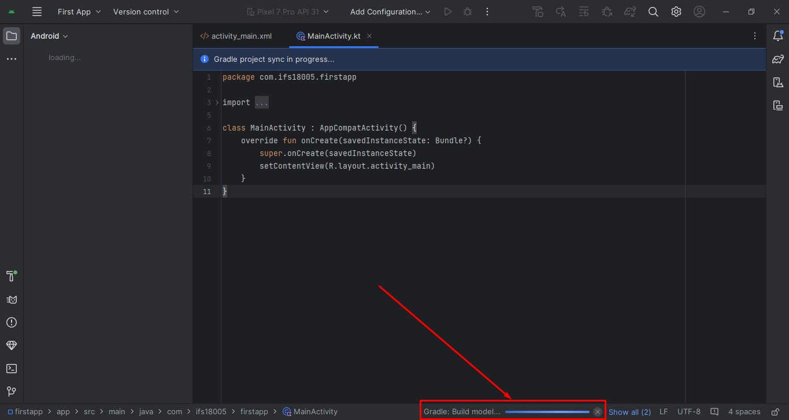
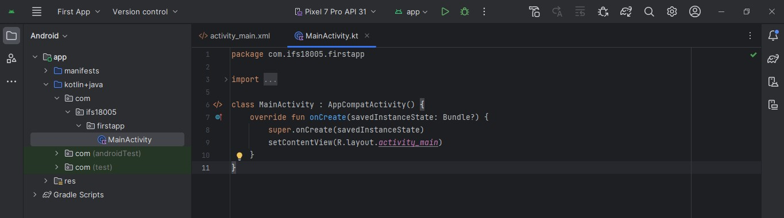
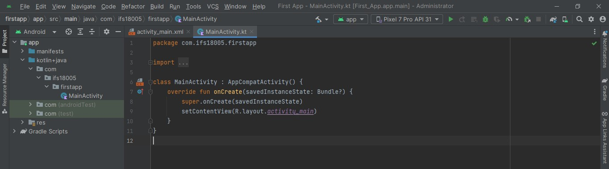
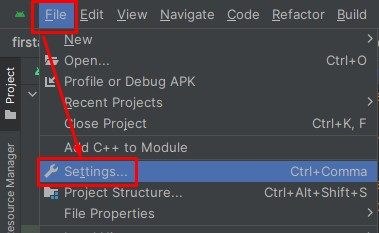
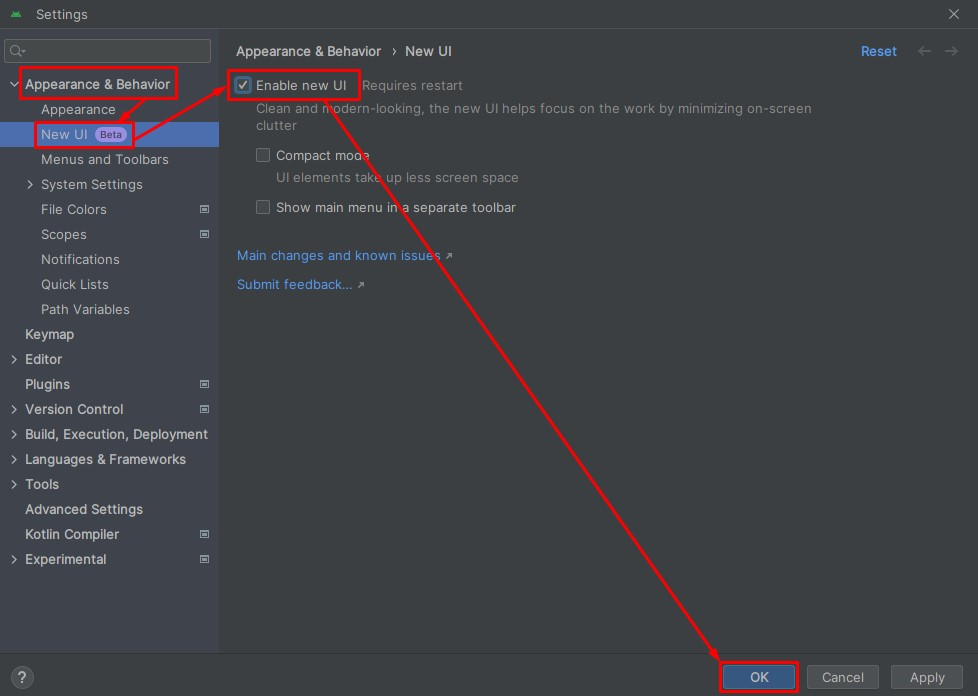
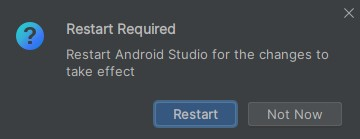

# Android Studio : New Projects

1. Silahkan membuka IDE Android Studio
	
2. Setelah berada dihalaman welcome Android Studio pilih `New Project`.
	
	
	
3. Akan tampil jendela untuk memilih `Templates` activity, silahkan pilih pada  `Empty Views Activity`. Setelah itu pilih tombol `Next`.
	
	
	
4. Akan tampil jendela untuk melakukan konfigurasi proyek Android Studio yang akan dibuat. Silahkan mengisi sesuai data berikut. Jangan lupa mengubah `ifs18005` dengan username kamu dan untuk `Save location` merupakan tempat proyek akan disimpan, silahkan sesuaikan dengan kebutuhan kamu. Setelah itu pilih tombol `Finish`.
	
	

5. Akan tampil jendela kerja Android Studio, silahkan menunggu sampai proses sinkronisasi selesai dengan melihat indikator yang berada di dekat sebelah kanan bawah.
	
	
	
6. Selamat kamu telah berhasil membuat proyek baru di Android Studio. Tampilan ini merupakan design baru dari Android Studio. Jika tampilan kamu berbeda dengan tampilan ini silahkan mengikuti tahapan selanjutnya untuk mengubah ke tampilan baru Android Studio.
	
	
	
7. Berikut adalah tampilan lama dari Android Studio.
	
	
	
8. Pada Android Studio pilih menu `File` selanjutnya pilih menu `Settings`.
	
	
	
9. Akan tampil jendela `Settings` pilih pada menu `Appearance & Behavior` di dalam menu ini pilih lagi menu `New UI` selanjutnya centang pada opsi `Enable new UI`. Setelah itu pilih tombol `Ok`.
	
	
	
10. Akan tampil dialog untuk melakukan restart Android Studio, silahkan pilih pada tombol `Restart`.
	
	
	
11. Selamat sekarang tampilan Android Studio kamu sudah menggunakan design baru.
	
	
	
	