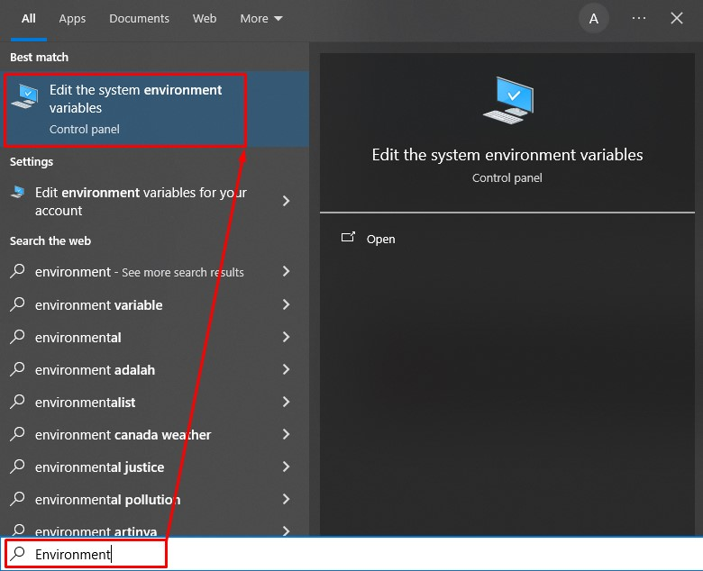
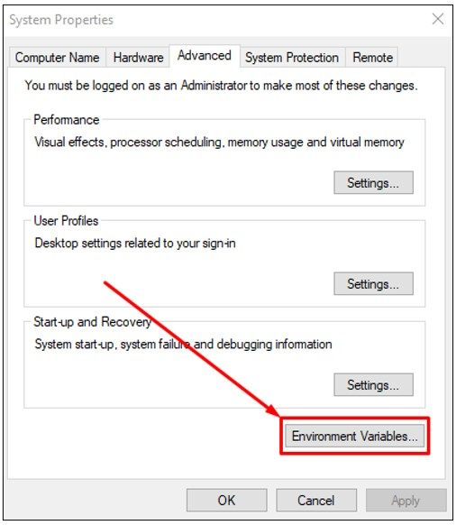
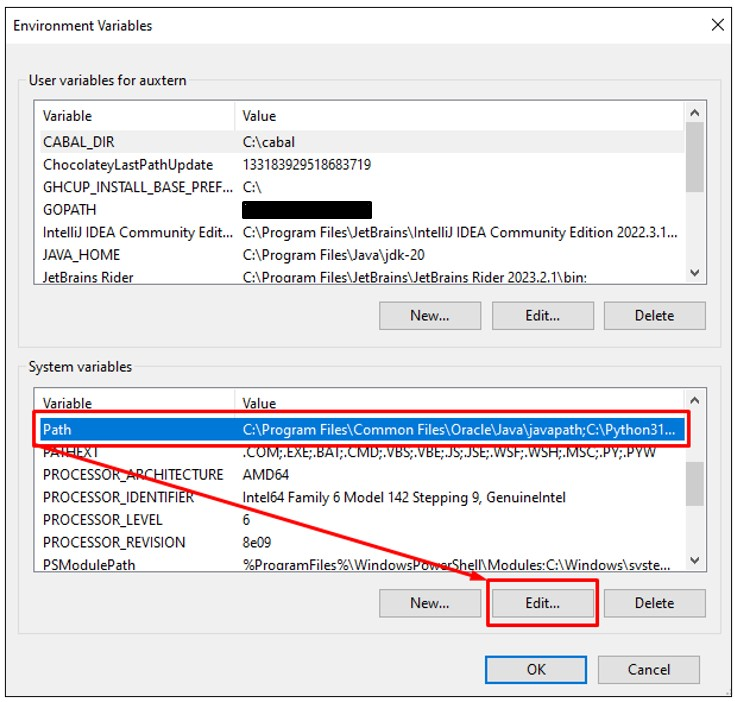

# Windows: Path Environment

1. Pada windows cari `Environment`. Dari hasil pencarian pilih pada program `Edit the system environment variables`.

	
	
2. Akan tampil dialog `System Properties` selanjutnya pilih pada tombol `Environment Variables`.

	
	
3. Akan tampil dialog `Environment Variables` selanjutnya pada bagian `System variables` di `Variable` pilih `Path`. Setelah itu pilih tombol `Edit`.

	
	
4. Akan tampil dialog `Edit environment variable` selanjutnya pilih tombol `New`. Akan tampil text field untuk tempat menuliskan lokasi program.  Silahkan isi sesuai lokasi program yang ingin ditambahkan agar dapat terbaca di lingkungan Windows. Pada kasus ini menggunakan lokasi `C:\compiler\ghc-9.4.8-x86_64-unknown-mingw32\bin`. Setelah selesai pilih tombol `Ok` untuk setiap dialog-dialog yang terbuka agar dialog-dialog tersebut tertutup.

	
	
5. Selamat kamu telah berhasil menambahkan lokasi program agar program-program di dalamnya dapat terbaca oleh lingkungan Windows.