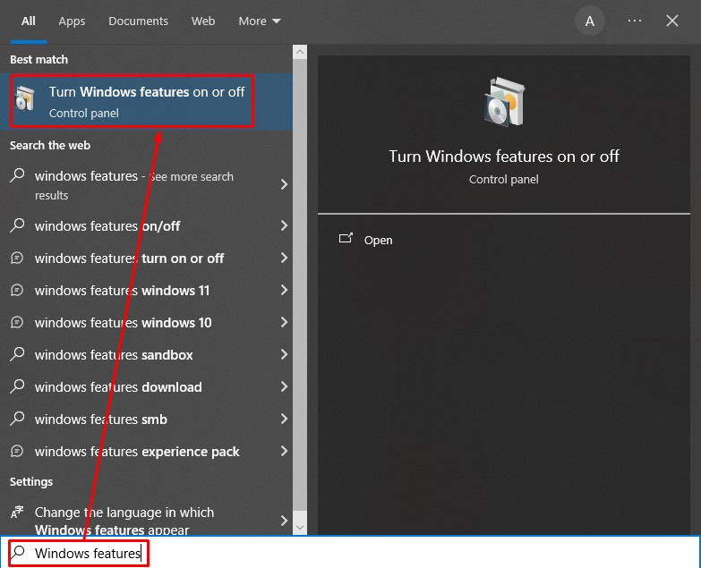
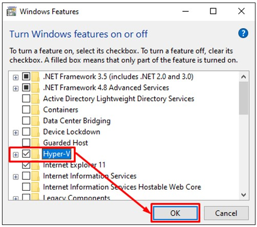
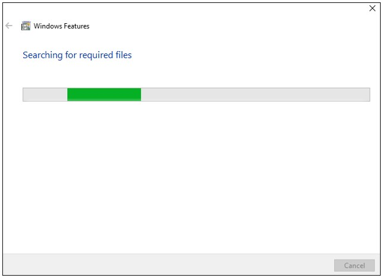
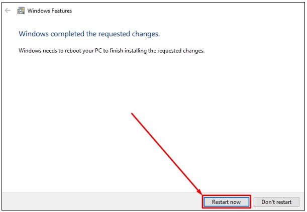
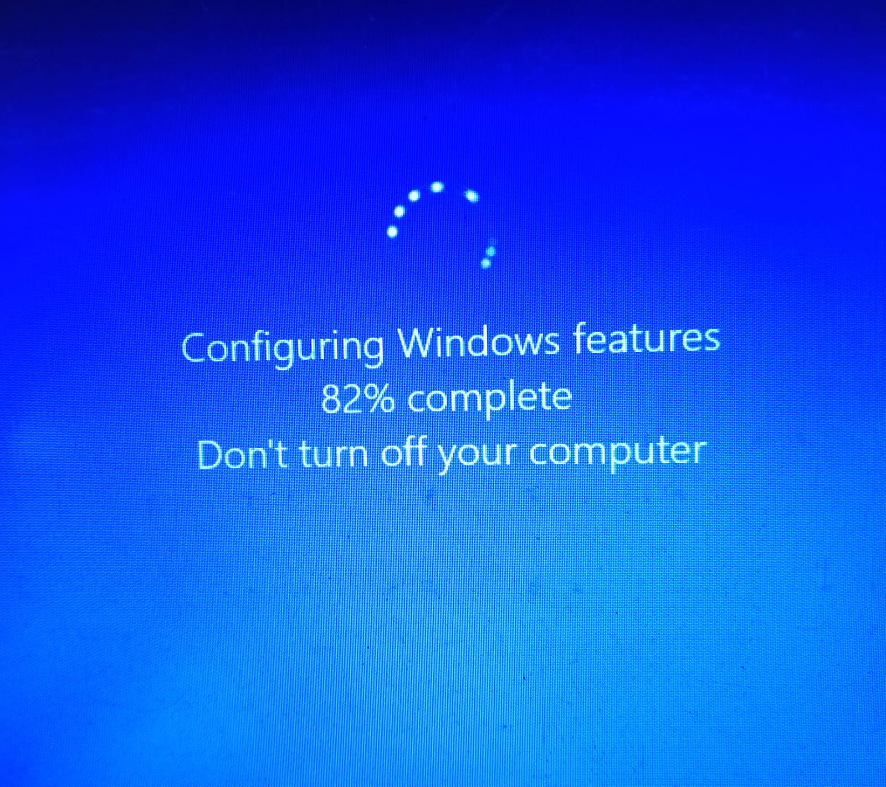

# Windows: Hyper-V

1. Pada Windows cari  `Windows features`. Dari hasil pencarian, silahkan pilih pada program `Turn Windows features on or off`.

   

2. Akan tampil jendela `Windows Features` selanjutnya cari dan centang pada opsi `Hyper-V`. Setelah itu pilih tombol `Ok`.

   

3. Tunggu sampai proses pengaktifan Hyper-V selesai.

   
   
4. Setelah Hyper-V selesai diaktifkan pilih tombol `Restart now`.

   
   
5. Windows akan melakukan update dan konfigurasi features, tunggu sampai proses update dan konfigurasi selesai.

   
   
6. Setelah selesai Windows kamu akan terbuka kembali. Selamat telah berhasil mengaktifkan Hyper-V.

   